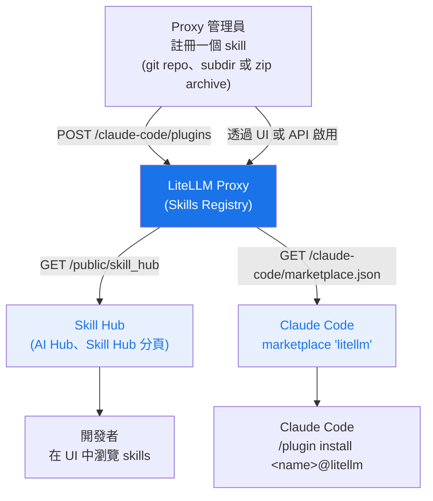

# 技能閘道 {#skills-gateway}

<iframe width="840" height="500" src="https://www.loom.com/embed/cb74eb79df3e4c2b83a6efae54a589f9" frameBorder="0" allowFullScreen></iframe>

LiteLLM 充當 **Skills Registry**，提供一個集中式位置，用於在您的組織內註冊、管理與探索 Claude Code skills。團隊只需發布一次 skill，開發者與 agent 就能透過單一 hub 找到它，並從一個 Claude Code marketplace 安裝。

## 運作方式 {#how-it-works}


```mermaid
graph TD
    Admin["Proxy 管理員<br/>註冊一個 skill<br/>(git repo、subdir 或 zip archive)"] -->|POST /claude-code/plugins| Proxy["LiteLLM Proxy<br/>(Skills Registry)"]
    Admin -->|透過 UI 或 API 啟用| Proxy

    Proxy -->|GET /public/skill_hub| SkillHub["Skill Hub<br/>(AI Hub、Skill Hub 分頁)"]
    Proxy -->|GET /claude-code/marketplace.json| Marketplace["Claude Code<br/>marketplace 'litellm'"]

    SkillHub --> Human["開發者<br/>在 UI 中瀏覽 skills"]
    Marketplace --> Agent["Claude Code<br/>/plugin install &lt;name&gt;@litellm"]

    style Proxy fill:#1a73e8,color:#fff
    style SkillHub fill:#e8f0fe,color:#1a73e8
    style Marketplace fill:#e8f0fe,color:#1a73e8
```

已啟用的 skills 是公開的：它們會出現在 Skill Hub 中，以及 `marketplace.json` 中，供任何可連到 proxy 的人使用。停用的 skills 則是私有的，只會提供給獲授權的 key 或 team（請參閱 [私人 skills](#private-skills)）。新 skills 在註冊後會立刻啟用，因此若要保持私有，請將其停用。只有 proxy 管理員可以建立、更新、啟用、停用或刪除 skills；任何其他 key 都會被拒絕，並回傳 `401` 或 `403`。

## 快速開始 {#quick-start}

### 1. 註冊技能 {#1-register-a-skill}

在 Admin UI 中開啟 **Skills**，點擊 **+ Add Skill**，然後貼上 GitHub URL、git clone URL（HTTPS 或 SSH），或 zip 檔案的 HTTPS 連結。LiteLLM 會偵測來源類型並建議 skill 名稱，包括位於子目錄中的 skills，例如 `github.com/org/repo/tree/main/skills/my-skill`。

或者，使用 admin key 透過 API 註冊：

```bash
curl -X POST https://your-proxy/claude-code/plugins \
  -H "Authorization: Bearer $LITELLM_MASTER_KEY" \
  -H "Content-Type: application/json" \
  -d '{
    "name": "grill-me",
    "source": {
      "source": "git-subdir",
      "url": "https://github.com/mattpocock/skills",
      "path": "skills/productivity/grill-me"
    },
    "description": "Interview skill for relentless questioning",
    "domain": "Productivity",
    "namespace": "interviews"
  }'
```

`POST` 只會建立。註冊一個已存在的名稱會回傳 `409`；請改用 `PUT /claude-code/plugins/{name}` 來變更現有的 skill。

### 2. 發布或取消發布 {#2-publish-or-unpublish}

新註冊的 skill 已經啟用且公開。若要變更哪些 skills 是公開的，請使用 Admin UI：**AI Hub → Skill Hub → Select Skills to Make Public**。

或者使用 API，透過 `/disable` 取消發布，透過 `/enable` 重新發布：

```bash
curl -X POST https://your-proxy/claude-code/plugins/grill-me/disable \
  -H "Authorization: Bearer $LITELLM_MASTER_KEY"
```

### 3. 瀏覽 hub {#3-browse-the-hub}

公開的 skills 會出現在 Admin UI 的 **AI Hub → Skill Hub** 下、位於 `/ui/model_hub` 的公開頁面上（在 **Skill Hub** 分頁中，無需登入），以及 API 的 `GET /public/skill_hub`。

### 4. 在 Claude Code 中安裝 {#4-install-in-claude-code}

只需新增一次 proxy marketplace。該 marketplace 一律命名為 `litellm`：

```
/plugin marketplace add https://your-proxy/claude-code/marketplace.json
```

接著只要透過 `<name>@litellm` 即可安裝任何 skill：

```
/plugin install grill-me@litellm
```

相同指令也可在 shell 中使用，作為 `claude plugin marketplace add <url>` 與 `claude plugin install grill-me@litellm`。

若要改以設定方式推出 marketplace，請將其加入 `extraKnownMarketplaces`。`source` 值是一個 object；平面的 `"source": "url"` 項目會被 Claude Code 視為無效的 marketplace 項目而遭忽略：

```json title="~/.claude/settings.json"
{
  "extraKnownMarketplaces": {
    "litellm": {
      "source": {
        "source": "url",
        "url": "https://your-proxy/claude-code/marketplace.json"
      }
    }
  }
}
```

## 私人 skills {#private-skills}

停用的 skill 會保留在 Skill Hub 與匿名 `marketplace.json` 之外，但您可以透過 `object_permission.skills` 將其授權給特定的 key 或 team。在 Admin UI 中，建立或編輯 key 或 team 時請使用 **Allowed Skills**。透過 API：

```bash
curl -X POST https://your-proxy/key/generate \
  -H "Authorization: Bearer $LITELLM_MASTER_KEY" \
  -H "Content-Type: application/json" \
  -d '{"object_permission": {"skills": ["internal-runbook"]}}'
```

當 key 與其 team 都列出 skills 時，該 key 會取得兩個清單的交集；否則會取得已設定的任一清單。開發者將 key 加入 marketplace URL，這樣他們被授權的 skills 就會顯示在公開 skills 旁邊：

```
/plugin marketplace add "https://your-proxy/claude-code/marketplace.json?key=sk-..."
```

`GET /claude-code/plugins` 與 `GET /claude-code/plugins/{name}` 套用相同規則：非管理員 key 會看到已啟用的 skills 以及授權給它的 skills，若某個停用的 skill 未授權給它，則會收到 `403`。Proxy 管理員可看到全部內容。

## 技能欄位 {#skill-fields}

| 欄位 | 說明 |
|-------|-------------|
| `name` | 唯一的 kebab-case 識別碼（`^[a-z0-9-]+$`），用於 `/plugin install <name>@litellm`。在建立時設定，之後固定不變 |
| `source` | Claude Code 取得 skill 的來源；請參閱 [來源格式](#source-formats) |
| `description` | 顯示在 hub 中的簡短描述 |
| `domain` | Skill Hub 中的頂層分組（例如 `Engineering`、`Productivity`） |
| `namespace` | 網域內的子分組（例如 `quality`、`meetings`） |
| `category` | 顯示在 marketplace 中的分類 |
| `keywords` | 用於搜尋與篩選的標籤 |
| `version` | Semver 字串；在建立時預設為 `1.0.0` |
| `author` | `{"name": "...", "email": "..."}` |
| `homepage` | 首頁 URL |

## 來源格式 {#source-formats}

| `source.source` | 必要欄位 | 範例 |
|-----------------|-----------------|---------|
| `github` | `repo` | `{"source": "github", "repo": "org/repo"}` |
| `url` | `url` | `{"source": "url", "url": "https://gitlab.com/org/repo.git"}` |
| `git-subdir` | `url`、`path` | `{"source": "git-subdir", "url": "https://github.com/org/repo.git", "path": "skills/my-skill"}` |
| `archive` | `url`（HTTPS），可選的 `sha256` | `{"source": "archive", "url": "https://bucket.s3.amazonaws.com/my-skill.zip", "sha256": "<64 hex chars>"}` |

`git-subdir` 路徑必須是以斜線分隔的相對段落，且僅能包含字母、數字、點、連字號與底線。`archive` URL 必須使用 HTTPS，而 `sha256` 若有提供，必須是 64 字元的十六進位摘要。Claude Code 會在開發者的機器上從這些來源下載，因此私人 repositories 和 archives 需要那裡的憑證。

## API 參考 {#api-reference}

| Endpoint | 驗證 | 說明 |
|----------|------|-------------|
| `POST /claude-code/plugins` | Proxy 管理員 | 建立 skill（若名稱已存在則為 `409`） |
| `GET /claude-code/plugins` | 任何 key | 列出呼叫者可見的 skills。`?enabled_only=true` 只會回傳公開的 skills |
| `GET /claude-code/plugins/{name}` | 任何 key | 取得單一 skill（若其已停用且未授權給呼叫者，則為 `403`） |
| `PUT /claude-code/plugins/{name}` | Proxy 管理員 | 取代 skill。省略的欄位會重設為預設值；若省略 `version`，則會清除 |
| `POST /claude-code/plugins/{name}/enable` | Proxy 管理員 | 發布 skill |
| `POST /claude-code/plugins/{name}/disable` | Proxy 管理員 | 取消發布 skill |
| `DELETE /claude-code/plugins/{name}` | Proxy 管理員 | 刪除 skill |
| `GET /public/skill_hub` | 無 | 列出公開 skills |
| `GET /claude-code/marketplace.json` | 無，或 `?key=` | Claude Code marketplace manifest。`?key=` 會加入授權給該 key 的已停用 skills |

## Agent Skills 探索索引 {#agent-skills-discovery-index}

透過 [`/v1/skills`](./skills.md) 上傳到 proxy 自有儲存區，且使用 `custom_llm_provider=litellm_proxy` 的 skills，也可以發布為 [Agent Skills](https://agentskills.io) 探索索引，因此任何支援此格式的 agent 都能以 `npx skills add` 安裝它們。此儲存區與上方的 Claude Code marketplace 分開：透過 `/claude-code/plugins` 註冊的 plugins 不會出現在其中。

預設為關閉索引，因為 discovery clients 不會送出憑證，因此啟用後，便會將每個已儲存的 skill 公開給任何可連到 proxy 的人：

```yaml title="config.yaml"
litellm_settings:
  public_skills_index: true
```

啟用後，proxy 會在 `GET /.well-known/agent-skills/index.json`（也可透過 `/.well-known/skills/index.json` 存取）提供索引，並在 `GET /v1/skills/{skill_id}/archive` 提供每個 skill 的 zip。當設定關閉時，這三條路由都會回傳 `404`。從用戶端安裝：

```bash
npx skills add https://your-proxy -a claude-code
```
