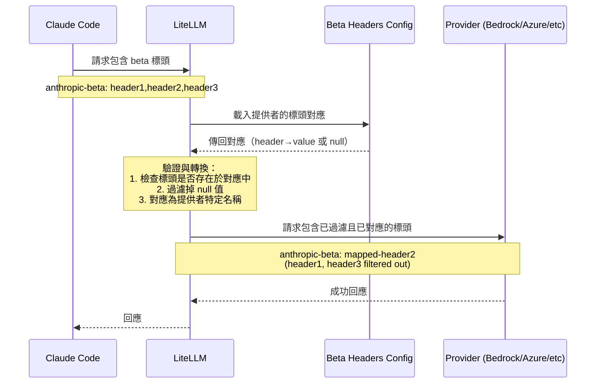

import Image from '@theme/IdealImage';

# Claude Code - 管理 Anthropic Beta 標頭 {#claude-code---managing-anthropic-beta-headers}

當您在 LiteLLM 中將 Claude Code 與非 Anthropic 提供者（Bedrock、Azure AI、Vertex AI）搭配使用時，您需要確保只會將各提供者支援的 beta 標頭傳送給對應的提供者。本指南說明如何新增對新 beta 標頭的支援，或修正無效 beta 標頭錯誤。

## 什麼是 Beta 標頭？ {#what-are-beta-headers}

Anthropic 使用 beta 標頭來啟用 Claude 中的實驗性功能。當您使用 Claude Code 時，可能會傳送如下的 beta 標頭：

```
anthropic-beta: prompt-caching-scope-2026-01-05,advanced-tool-use-2025-11-20
```

不過，並非所有提供者都支援所有 Anthropic beta 功能。LiteLLM 使用 `anthropic_beta_headers_config.json` 來管理各提供者支援哪些 beta 標頭。

## 常見錯誤訊息 {#common-error-message}

```bash
Error: The model returned the following errors: invalid beta flag
```

## LiteLLM 如何處理 Beta 標頭 {#how-litellm-handles-beta-headers}

LiteLLM 使用嚴格的驗證方式搭配設定檔：

```
litellm/litellm/anthropic_beta_headers_config.json
```

此 JSON 檔案包含各提供者 beta 標頭的**對應**：
- **Keys**：輸入的 beta 標頭名稱（來自 Anthropic）
- **Values**：提供者特定的標頭名稱（或 `null`，若不支援）
- **驗證**：只有對應中存在且值非 null 的標頭才會被轉送

這比單純過濾不支援的標頭更嚴格——標頭必須明確定義才會被允許。

## 新增對 Beta 標頭的支援 {#adding-support-for-a-new-beta-header}

當 Anthropic 釋出新的 beta 功能時，您需要將其加入各提供者的設定檔中。

### 步驟 1：找到設定檔 {#step-1-locate-the-config-file}

在您的 LiteLLM 安裝中找到此檔案：

```bash
# If installed via pip
cd $(python -c "import litellm; import os; print(os.path.dirname(litellm.__file__))")

# The config file is at:
# litellm/anthropic_beta_headers_config.json
```

### 步驟 2：新增新的 Beta 標頭 {#step-2-add-the-new-beta-header}

開啟 `anthropic_beta_headers_config.json` 並將新的標頭加入每個提供者的對應中：

```json title="anthropic_beta_headers_config.json"
{
  "description": "Mapping of Anthropic beta headers for each provider. Keys are input header names, values are provider-specific header names (or null if unsupported). Only headers present in mapping keys with non-null values can be forwarded.",
  "anthropic": {
    "advanced-tool-use-2025-11-20": "advanced-tool-use-2025-11-20",
    "new-feature-2026-03-01": "new-feature-2026-03-01",
    ...
  },
  "azure_ai": {
    "advanced-tool-use-2025-11-20": "advanced-tool-use-2025-11-20",
    "new-feature-2026-03-01": "new-feature-2026-03-01",
    ...
  },
  "bedrock_converse": {
    "advanced-tool-use-2025-11-20": "tool-search-tool-2025-10-19",
    "new-feature-2026-03-01": null,
    ...
  },
  "bedrock": {
    "advanced-tool-use-2025-11-20": "tool-search-tool-2025-10-19",
    "new-feature-2026-03-01": null,
    ...
  },
  "vertex_ai": {
    "advanced-tool-use-2025-11-20": "tool-search-tool-2025-10-19",
    "new-feature-2026-03-01": null,
    ...
  }
}
```

**重點：**
- **支援的標頭**：將值設為提供者特定的標頭名稱（通常與 key 相同）
- **不支援的標頭**：將值設為 `null`
- **標頭轉換**：有些提供者會使用不同的標頭名稱（例如，Bedrock 會將 `advanced-tool-use-2025-11-20` 對應到 `tool-search-tool-2025-10-19`）
- **字母順序**：請將標頭依字母順序排序，以利維護

### 步驟 3：重新載入設定（不需要重新啟動！） {#step-3-reload-configuration-no-restart-required}

**選項 1：不重新啟動即可動態重新載入** 

您可以使用環境變數和 API 端點動態重新載入 beta 標頭設定，而不必重新啟動應用程式：

```bash
# Set environment variable to fetch from remote URL (Do this if you want to point it to some other URL)
export LITELLM_ANTHROPIC_BETA_HEADERS_URL="https://raw.githubusercontent.com/BerriAI/litellm/main/litellm/anthropic_beta_headers_config.json"

# Manually trigger reload via API (no restart needed!)
curl -X POST "https://your-proxy-url/reload/anthropic_beta_headers" \
  -H "Authorization: Bearer YOUR_ADMIN_TOKEN"
```

**選項 2：排程自動重新載入** 

設定自動重新載入，確保永遠使用最新的 beta 標頭：

```bash
# Reload configuration every 24 hours
curl -X POST "https://your-proxy-url/schedule/anthropic_beta_headers_reload?hours=24" \
  -H "Authorization: Bearer YOUR_ADMIN_TOKEN"
```

**選項 3：傳統重新啟動**

如果您偏好傳統方式，請重新啟動您的 LiteLLM proxy 或應用程式：

```bash
# If using LiteLLM proxy
litellm --config config.yaml

# If using Python SDK
# Just restart your Python application
```

:::tip 零停機更新
使用動態重新載入，您可以在**不重新啟動服務**的情況下修正無效 beta 標頭錯誤！這在停機代價高昂的正式環境中特別有用。

請參閱 [自動同步 Anthropic Beta 標頭](../proxy/sync_anthropic_beta_headers.md) 以取得完整文件。
:::

## 修正無效 Beta 標頭錯誤 {#fixing-invalid-beta-header-errors}

如果您遇到「invalid beta flag」錯誤，表示有一個該提供者不支援的 beta 標頭正在被傳送。

### 步驟 1：找出有問題的標頭 {#step-1-identify-the-problematic-header}

檢查您的記錄，查看是哪個標頭造成問題：

```bash
Error: The model returned the following errors: invalid beta flag: new-feature-2026-03-01
```

### 步驟 2：更新設定 {#step-2-update-the-config}

將該提供者的標頭值設為 `null`：

```json title="anthropic_beta_headers_config.json"
{
  "bedrock_converse": {
    "new-feature-2026-03-01": null
  }
}
```

### 步驟 3：重新啟動並測試 {#step-3-restart-and-test}

重新啟動您的應用程式並確認該標頭現在已被過濾掉。

## 將修正貢獻給 LiteLLM {#contributing-a-fix-to-litellm}

透過貢獻您的修正來幫助社群！

### 您的 PR 需要包含什麼 {#what-to-include-in-your-pr}

1. **更新設定檔**：將新的 beta 標頭加入 `litellm/anthropic_beta_headers_config.json`
2. **測試您的變更**：確認該標頭能正確地針對每個提供者被過濾/對應
3. **文件**：附上提供者文件連結，說明哪些標頭受支援

### PR 說明範例 {#example-pr-description}

```markdown
## Add support for new-feature-2026-03-01 beta header

### Changes
- Added `new-feature-2026-03-01` to anthropic_beta_headers_config.json
- Set to `null` for bedrock_converse (unsupported)
- Set to header name for anthropic, azure_ai (supported)

### Testing
Tested with:
- ✅ Anthropic: Header passed through correctly
- ✅ Azure AI: Header passed through correctly  
- ✅ Bedrock Converse: Header filtered out (returns error without fix)

### References
- Anthropic docs: [link]
- AWS Bedrock docs: [link]
```


## Beta 標頭過濾的運作方式 {#how-beta-header-filtering-works}

當您透過 LiteLLM 發出請求時：



### 過濾規則 {#filtering-rules}

1. **標頭必須存在於對應中**：未知標頭會被過濾掉
2. **標頭必須有非 null 值**：值為 `null` 的標頭會被過濾掉
3. **標頭轉換**：標頭會對應為提供者特定名稱（例如，Bedrock 會將 `advanced-tool-use-2025-11-20` → `tool-search-tool-2025-10-19`）

### 範例 {#example}

包含以下標頭的請求：
```
anthropic-beta: advanced-tool-use-2025-11-20,computer-use-2025-01-24,unknown-header
```

對於 Bedrock Converse：
- ✅ `computer-use-2025-01-24` → `computer-use-2025-01-24`（支援，直接傳遞）
- ❌ `advanced-tool-use-2025-11-20` → 過濾掉（設定中為 null 值）
- ❌ `unknown-header` → 過濾掉（不在設定中）

傳送給 Bedrock 的結果：
```
anthropic-beta: computer-use-2025-01-24
```

## 動態設定管理（不需要重新啟動！） {#dynamic-configuration-management-no-restart-required}

### 環境變數 {#environment-variables}

控制 LiteLLM 如何載入 beta 標頭設定：

| 變數 | 說明 | 預設值 |
|----------|-------------|---------|
| `LITELLM_ANTHROPIC_BETA_HEADERS_URL` | 用來擷取設定的 URL | GitHub main branch |
| `LITELLM_LOCAL_ANTHROPIC_BETA_HEADERS` | 設為 `True` 以僅使用本機設定 | `False` |

**範例：使用自訂設定 URL**
```bash
export LITELLM_ANTHROPIC_BETA_HEADERS_URL="https://your-company.com/custom-beta-headers.json"
```

**範例：僅使用本機設定（不從遠端擷取）**
```bash
export LITELLM_LOCAL_ANTHROPIC_BETA_HEADERS=True
```
## 提供者特定說明 {#provider-specific-notes}

### Bedrock {#bedrock}
- Beta 標頭同時會出現在 HTTP 標頭和請求主體中（`additionalModelRequestFields.anthropic_beta`）
- 某些標頭會被轉換（例如，`advanced-tool-use` → `tool-search-tool`）

### Azure AI {#azure-ai}
- 使用與 Anthropic 相同的標頭名稱
- 某些功能尚未支援（請檢查設定中的 null 值）

### Vertex AI {#vertex-ai}
- 某些標頭會被轉換以符合 Vertex AI 的實作
- 與 Anthropic 相比，beta 功能支援有限
