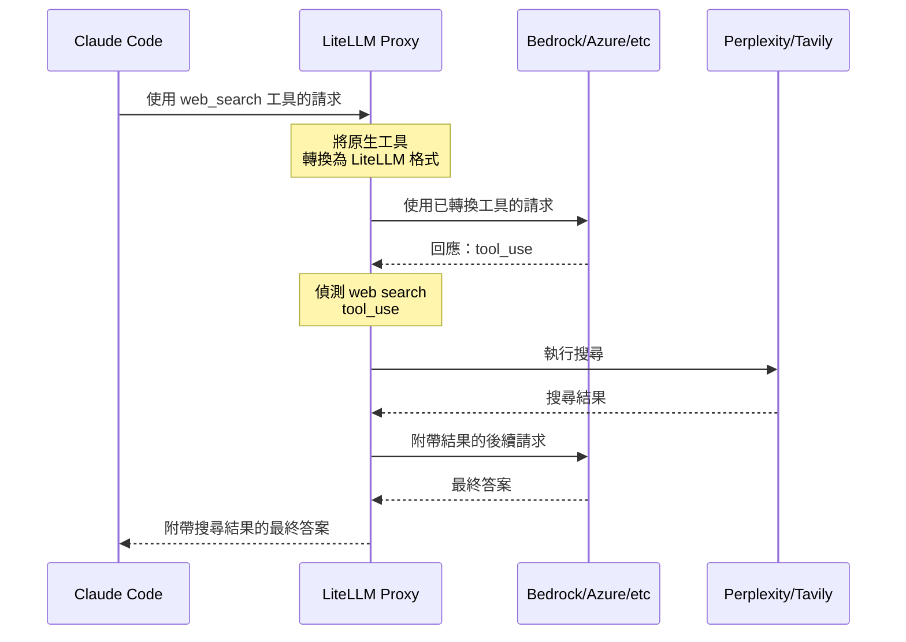

import Image from '@theme/IdealImage';

# Claude Code - 跨所有提供者的 WebSearch {#claude-code---websearch-across-all-providers}

啟用 Claude Code 的 web search 工具，使其可與任何提供者（Bedrock、Azure、Vertex 等）搭配使用。LiteLLM 會自動攔截 web search 請求，並在伺服器端執行。

<Image img={require('../../img/claude_code_websearch.png')} />

## Proxy 設定 {#proxy-configuration}

將 WebSearch 攔截加入您的 `litellm_config.yaml`：

```yaml showLineNumbers title="litellm_config.yaml"
model_list:
  - model_name: bedrock-sonnet
    litellm_params:
      model: bedrock/us.anthropic.claude-sonnet-4-5-20250929-v1:0
      aws_region_name: us-east-1

# Enable WebSearch interception for providers
litellm_settings:
  callbacks: ["websearch_interception"]
  websearch_interception_params:
    enabled_providers:
      - bedrock
      - azure
      - vertex_ai
    search_tool_name: perplexity-search  # Optional: specific search tool

# Configure search provider
search_tools:
  - search_tool_name: perplexity-search
    litellm_params:
      search_provider: perplexity
      api_key: os.environ/PERPLEXITY_API_KEY
```

## 快速開始 {#quick-start}

### 1. 設定 LiteLLM Proxy {#1-configure-litellm-proxy}

建立 `config.yaml`：

```yaml showLineNumbers title="config.yaml"
model_list:
  - model_name: bedrock-sonnet
    litellm_params:
      model: bedrock/us.anthropic.claude-sonnet-4-5-20250929-v1:0
      aws_region_name: us-east-1

litellm_settings:
  callbacks: ["websearch_interception"]
  websearch_interception_params:
    enabled_providers: [bedrock]

search_tools:
  - search_tool_name: perplexity-search
    litellm_params:
      search_provider: perplexity
      api_key: os.environ/PERPLEXITY_API_KEY
```

### 2. 啟動 Proxy {#2-start-proxy}

```bash showLineNumbers title="Start LiteLLM Proxy"
export PERPLEXITY_API_KEY=your-key
litellm --config config.yaml
```

### 3. 與 Claude Code 搭配使用 {#3-use-with-claude-code}

```bash showLineNumbers title="Configure Claude Code"
export ANTHROPIC_BASE_URL=http://localhost:4000
export ANTHROPIC_API_KEY=sk-1234
claude
```

現在可在 Claude Code 中使用 web search——它可與任何提供者搭配運作！

## 運作方式 {#how-it-works}

當 Claude Code 傳送 web search 請求時，LiteLLM：
1. 攔截原生的 `web_search` 工具
2. 將其轉換為 LiteLLM 的標準格式
3. 透過 Perplexity/Tavily 執行搜尋
4. 將最終答案回傳給 Claude Code



**結果**：Claude Code 一次 API 呼叫 → 包含搜尋結果的完整答案

## 支援的提供者 {#supported-providers}

| 提供者 | 原生 Web Search | 使用 LiteLLM |
|----------|-------------------|--------------|
| **Anthropic** | ✅ 是 | ✅ 是 |
| **Bedrock** | ❌ 否 | ✅ 是 |
| **Azure** | ❌ 否 | ✅ 是 |
| **Vertex AI** | ❌ 否 | ✅ 是 |
| **其他提供者** | ❌ 否 | ✅ 是 |

## 搜尋提供者 {#search-providers}

設定要使用哪個搜尋提供者。LiteLLM 支援多種搜尋提供者：

| 提供者 | `search_provider` 值 | 環境變數 |
|----------|------------------------|----------------------|
| **Perplexity AI** | `perplexity` | `PERPLEXITYAI_API_KEY` |
| **Tavily** | `tavily` | `TAVILY_API_KEY` |
| **Exa AI** | `exa_ai` | `EXA_API_KEY` |
| **Parallel AI** | `parallel_ai` | `PARALLEL_AI_API_KEY` |
| **Google PSE** | `google_pse` | `GOOGLE_PSE_API_KEY`, `GOOGLE_PSE_ENGINE_ID` |
| **DataForSEO** | `dataforseo` | `DATAFORSEO_LOGIN`, `DATAFORSEO_PASSWORD` |
| **Firecrawl** | `firecrawl` | `FIRECRAWL_API_KEY` |
| **SearXNG** | `searxng` | `SEARXNG_API_BASE`（必填） |
| **Linkup** | `linkup` | `LINKUP_API_KEY` |

請參閱[所有支援的搜尋提供者](../search/index.md)，以取得詳細的設定說明與各提供者專屬參數。

## 設定選項 {#configuration-options}

### WebSearch 攔截參數 {#websearch-interception-parameters}

| 參數 | 類型 | 必填 | 說明 | 範例 |
|-----------|------|----------|-------------|---------|
| `enabled_providers` | List[String] | 是 | 要啟用 web search 攔截的提供者清單 | `[bedrock, azure, vertex_ai]` |
| `search_tool_name` | String | 否 | `search_tools` 設定中的特定搜尋工具。若未設定，則使用第一個可用的搜尋工具。 | `perplexity-search` |

### 支援的提供者值 {#supported-provider-values}

在 `enabled_providers` 中使用這些值：

| 提供者 | 值 | 說明 |
|----------|-------|-------------|
| AWS Bedrock | `bedrock` | Amazon Bedrock Claude models |
| Azure OpenAI | `azure` | Azure-hosted models |
| Google Vertex AI | `vertex_ai` | Google Cloud Vertex AI |
| 其他任何 | Provider name | 任何 LiteLLM 支援的提供者 |

### 完整設定範例 {#complete-configuration-example}

```yaml showLineNumbers title="Complete config.yaml"
model_list:
  - model_name: bedrock-sonnet
    litellm_params:
      model: bedrock/us.anthropic.claude-sonnet-4-5-20250929-v1:0
      aws_region_name: us-east-1

  - model_name: azure-gpt4
    litellm_params:
      model: azure/gpt-4
      api_base: https://my-azure.openai.azure.com
      api_key: os.environ/AZURE_API_KEY

litellm_settings:
  callbacks: ["websearch_interception"]
  websearch_interception_params:
    enabled_providers:
      - bedrock        # Enable for AWS Bedrock
      - azure          # Enable for Azure OpenAI
      - vertex_ai      # Enable for Google Vertex
    search_tool_name: perplexity-search  # Optional: use specific search tool

# Configure search tools
search_tools:
  - search_tool_name: perplexity-search
    litellm_params:
      search_provider: perplexity
      api_key: os.environ/PERPLEXITY_API_KEY

  - search_tool_name: tavily-search
    litellm_params:
      search_provider: tavily
      api_key: os.environ/TAVILY_API_KEY
```

**搜尋工具選擇的運作方式：**
- 若指定 `search_tool_name` → 使用該特定搜尋工具
- 若未指定 `search_tool_name` → 使用 `search_tools` 清單中的第一個搜尋工具
- 在上方範例中：若未指定 `search_tool_name`，則會使用 `perplexity-search`（清單中的第一個）

## 相關內容 {#related}

- [Claude Code 快速入門](./claude_responses_api.md)
- [Claude Code 成本追蹤](./claude_code_customer_tracking.md)
- [使用非 Anthropic 模型](./claude_non_anthropic_models.md)
