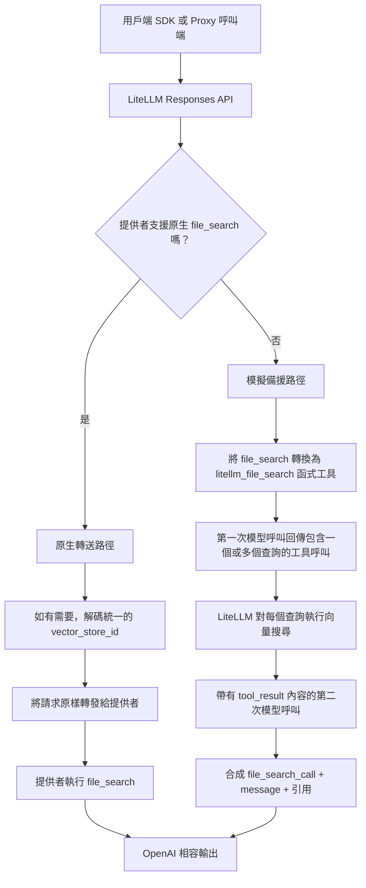

import Tabs from '@theme/Tabs';
import TabItem from '@theme/TabItem';

# Responses API 中的檔案搜尋 {#file-search-in-the-responses-api}

LiteLLM 現在支援 `file_search`，適用於以下兩種 Responses API：
- 原生支援此功能的提供者（例如 OpenAI / Azure），以及
- 不原生支援此功能的提供者（例如 Anthropic、Bedrock 及其他非原生提供者），透過模擬方式支援。

## 這是什麼 {#what-this-is}

`file_search` 可讓模型從您的向量儲存區擷取有依據的內容，並附上引用來回答。
LiteLLM 會維持單一 OpenAI 相容的輸出格式，同時將請求透過原生轉送或模擬備援路徑進行路由。

涵蓋兩條路徑：

| 路徑 | 執行時機 | LiteLLM 的處理方式 |
| --- | --- | --- |
| **原生轉送** | 提供者原生支援 `file_search`（OpenAI、Azure） | 解碼統一的 vector store ID → 原樣轉發給提供者 |
| **模擬備援** | 提供者不支援 `file_search`（Anthropic、Bedrock 等） | 轉換為函式工具 → 攔截工具呼叫 → 執行向量搜尋 → 合成 OpenAI 格式輸出 |

在 `tools[].vector_store_ids` 中，LiteLLM 同時接受提供者原生 ID（例如 `vs_...`）**以及** **受管理向量儲存區統一 ID**（來自 proxy managed-vector 流程的 URL-safe base64 字串），例如 `litellm.responses(..., tools=[{"type": "file_search", "vector_store_ids": ["bGl0ZWxsbV9wcm94eT..."]}])`。

## 用法 {#usage}

<Tabs>
<TabItem value="proxy" label="LiteLLM Proxy" default>

### 1. 設定 `config.yaml` {#1-setup-configyaml}

```yaml title="config.yaml"
model_list:
  - model_name: gpt-4.1
    litellm_params:
      model: openai/gpt-4.1
      api_key: os.environ/OPENAI_API_KEY

  - model_name: claude-sonnet
    litellm_params:
      model: anthropic/claude-sonnet-4-5
      api_key: os.environ/ANTHROPIC_API_KEY
```

### 2. 啟動 proxy {#2-start-the-proxy}

```bash
litellm --config config.yaml
```

### 3. 使用 `file_search` 呼叫 Responses API {#3-call-responses-api-with-file_search}

```python title="Proxy call"
from openai import OpenAI

client = OpenAI(base_url="http://localhost:4000", api_key="sk-your-proxy-key")

response = client.responses.create(
    model="claude-sonnet",  # swap to "gpt-4.1" for native path
    input="What does LiteLLM support?",
    tools=[{
        "type": "file_search",
        "vector_store_ids": ["vs_abc123"]
    }],
    include=["file_search_call.results"],
)

print(response.output)
```

</TabItem>
<TabItem value="sdk" label="LiteLLM SDK">

### 1. 安裝 + 設定金鑰 {#1-install--set-keys}

```bash
uv add litellm
export OPENAI_API_KEY="sk-..."
export ANTHROPIC_API_KEY="sk-ant-..."
```

### 2. 使用 `file_search` 呼叫 Responses API {#2-call-responses-api-with-file_search}

```python title="SDK call"
import litellm

response = litellm.responses(
    model="anthropic/claude-sonnet-4-5",  # swap to openai/gpt-4.1 for native path
    input="What does LiteLLM support?",
    tools=[{
        "type": "file_search",
        "vector_store_ids": ["vs_abc123"]
    }],
    include=["file_search_call.results"],
)

print(response.output)
```

</TabItem>
</Tabs>

### 行為矩陣 {#behavior-matrix}

| 路徑 | SDK model | Proxy model | 行為 |
| --- | --- | --- | --- |
| 原生轉送 | `openai/gpt-4.1` | `gpt-4.1` | 提供者執行原生 `file_search` |
| 模擬備援 | `anthropic/claude-sonnet-4-5` | `claude-sonnet` | LiteLLM 轉換為函式工具並合成 OpenAI 格式輸出 |

## 架構圖 {#architecture-diagram}



## 先決條件 {#prerequisites}

```bash
uv tool install 'litellm[proxy]'
export OPENAI_API_KEY="sk-..."          # for native path
export ANTHROPIC_API_KEY="sk-ant-..."  # for emulated path
```


## 範例回應格式 {#example-response-shape}

## 驗證輸出格式 {#validating-the-output-format}

無論執行哪條路徑，回應都會遵循 OpenAI Responses API 格式：

```json
{
  "output": [
    {
      "type": "file_search_call",
      "id": "fs_abc123",
      "status": "completed",
      "queries": ["What does LiteLLM support?"],
      "search_results": null
    },
    {
      "type": "message",
      "role": "assistant",
      "content": [
        {
          "type": "output_text",
          "text": "LiteLLM is a unified interface...",
          "annotations": [
            {
              "type": "file_citation",
              "index": 150,
              "file_id": "file-xxxx",
              "filename": "knowledge.txt"
            }
          ]
        }
      ]
    }
  ]
}
```

**驗證腳本：**

```python showLineNumbers title="Validate response structure"
def validate_file_search_response(response):
    """Assert that response follows OpenAI file_search output format."""
    output = response.output
    assert len(output) >= 2, "Expected at least 2 output items"

    # First item: file_search_call
    fs_call = output[0]
    fs_type = fs_call["type"] if isinstance(fs_call, dict) else fs_call.type
    assert fs_type == "file_search_call", f"Expected file_search_call, got {fs_type}"

    fs_status = fs_call["status"] if isinstance(fs_call, dict) else fs_call.status
    assert fs_status == "completed"

    # Second item: message
    msg = output[1]
    msg_type = msg["type"] if isinstance(msg, dict) else msg.type
    assert msg_type == "message"

    content = msg["content"] if isinstance(msg, dict) else msg.content
    assert len(content) > 0
    text_block = content[0]
    text = text_block["text"] if isinstance(text_block, dict) else text_block.text
    assert isinstance(text, str) and len(text) > 0

    print("✅ Response structure valid")
    print(f"   Queries: {fs_call['queries'] if isinstance(fs_call, dict) else fs_call.queries}")
    print(f"   Answer length: {len(text)} chars")
    annotations = text_block["annotations"] if isinstance(text_block, dict) else text_block.annotations
    print(f"   Citations: {len(annotations)}")

validate_file_search_response(response)
```


## 問答 {#qa}

- **為什麼我會看到 `UnsupportedParamsError`？** 這通常表示 `file_search` 已傳遞給不原生支援它的提供者，而模擬無法正確路由。請檢查：
  - model 字串是否有效（例如，`anthropic/claude-sonnet-4-5`）。
  - `custom_llm_provider` 是否正確解析，讓 LiteLLM 能載入提供者設定。
- **為什麼向量搜尋沒有回傳結果？** 常見原因：
  - 向量儲存區 ID 錯誤，或未附加任何檔案。
  - 在 LiteLLM 管理的儲存區中，檔案擷取尚未完成（`status != completed`）。
  - 查詢條件太窄；請嘗試更廣泛的查詢。
- **為什麼我在向量儲存區呼叫時收到 `403 Access denied`？** 呼叫端沒有該向量儲存區的存取權限。
  - 該儲存區可能屬於其他團隊。
  - 如果您的設定需要跨團隊存取，請使用管理員/proxy 金鑰。
- **為什麼在模擬模式下 `annotations` 是空的？** `file_citation` 註解需要搜尋結果中的 `file_id` 中繼資料。如果您的向量後端未回傳檔案層級的中繼資料，答案文字仍會產生，但引用可能為空。

## 接下來要檢查什麼 {#what-to-check-next}

- [Responses API 文件中的 File Search 參考](/docs/response_api#file-search-vector-stores) — 完整 API 參考
- [向量儲存區管理](/docs/vector_store_files) — 建立並管理向量儲存區
- [受管理向量儲存區](/docs/providers/bedrock_vector_store) — 提供者特定設定
