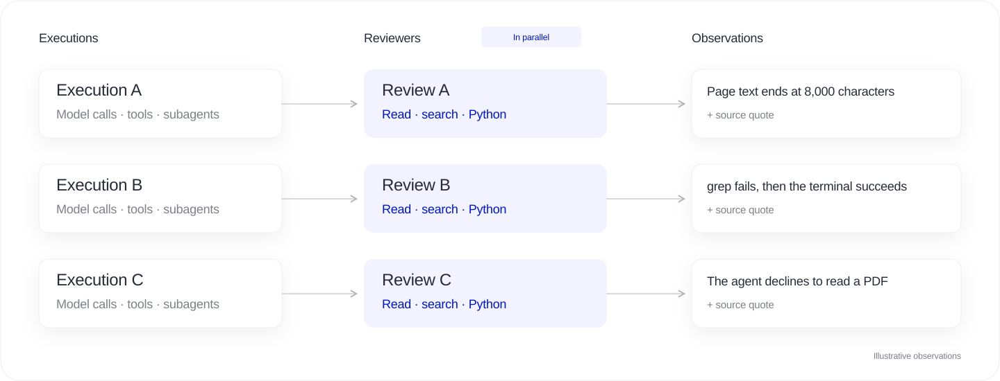
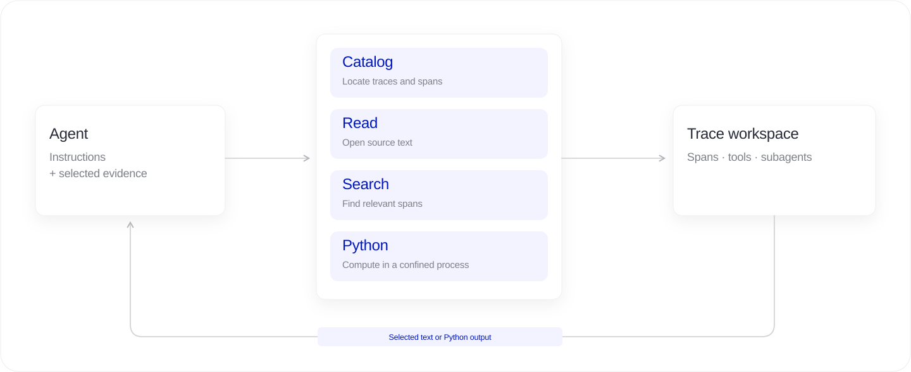
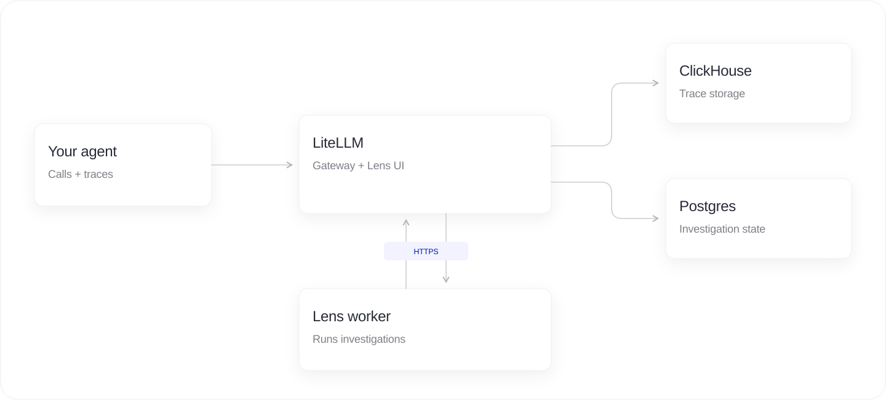

import LensHero from './LensHero';

export const Hero = LensHero;

A research agent can finish a report after reading the first 8,000 characters of each page. If its web tool cuts off a source and the agent fills in the gaps, you get a completed run with unsupported claims.

Across thousands of runs, you need to find the affected sessions and what they have in common. [LiteLLM Lens](/blog/litellm-lens-launch) uses agents to do that work.

Here's how it works behind the scenes: reviewers inspect executions in parallel, grouping agents connect related observations, and investigators check each candidate pattern against the original traces.

{/* truncate */}

## Phase 1: Review each execution

We give each execution its own reviewer and run the reviewers in parallel. Each has a complete run to investigate, because a tool response near the start may explain an incorrect answer hundreds of steps later.

The reviewer decides what to read and follows leads through tool results and subagent handoffs. It keeps going until it has observations to return, and can open other selected executions if it needs a comparison.

In the research example, a reviewer might notice that a page ends mid-sentence and the final answer contains claims the returned text doesn't support. It records what it found with citations and leaves the cause open for investigation.

We ask reviewers to examine the process as well as the outcome. An agent might try an incompatible `grep` tool five times before succeeding through a terminal. We want to keep those failed attempts in view, even though the agent completed the task.

## Reviewers can use Python

We give reviewers a workspace containing the traces and tools to inspect them, much like a coding agent working in a repository. They can read and search the evidence, or write Python to answer questions that need computation.

For the research example, a reviewer could write a short script to compare response lengths and find pages that stop at the same point. It uses those measurements to decide which responses to open and which claims to check. It can use the same approach to count repeated failures or reconstruct a sequence of subagent calls.

The traces stay in the workspace, and the reviewer brings the passages or computed results it needs into the model's context. A trace can be larger than the context window because the agent can search and analyze it in pieces.

Python runs in a confined environment without network access. As an investigation grows, the agents can compact their conversations into working notes and return to earlier evidence when they need it.

## Phase 2: Group related observations

Several reviewers may flag the same underlying problem. We group their observations in parallel batches, then merge matches across batches so an investigator can examine the examples together.

We group by the check and suspected cause. A missing PDF tool needs a different fix from a failing PDF renderer, so those should remain separate candidates.

For the page-cutoff example, we collect observations about abrupt endings and unsupported claims into a candidate about missing source content. The investigator gets examples from different runs, with links to their evidence, and can test whether one explanation accounts for them.

## Phase 3: Investigate the candidate

We start an investigator for each candidate and run these agents in parallel. They get the reviewers' observations and access to the original traces, with the same read, search, and Python tools.

We send investigators back to the original traces because a reviewer may have left out context that changes the explanation. In the research case, the investigator compares page responses with final claims. It also looks for counterexamples, such as runs where the agent acknowledged missing information or fetched the rest of the source.

When different pages repeatedly return exactly 8,000 characters, that suggests the tool is cutting them off at a fixed limit. The investigator still needs to check whether the missing content explains a false claim, and distinguish that evidence from a plausible guess.

The investigator can drop a candidate that doesn't hold up. Before saving a finding, the worker checks its citations against the source and sends invalid quotes back for repair. An exact quote can still support a bad interpretation, so we check that distinction in our evaluations too.

## Checking the design on a real trace

On a real coding-agent session with 350 spans, reviewers and investigators used Python to inspect validation commands. They found checks piped through `tail` that reported success even when the underlying check failed. Lens identified the problem and the later passing checks, without claiming those failures remained in the delivered code. We checked the findings' citations against the source.

A search in that session returned more than 544,000 characters. Tool access gives agents control over what they read, but they can still request too much. We inspect their tool use alongside the quality of their findings.

## How results reach Lens

The worker sends progress and findings to the LiteLLM gateway, so you can watch completed reviews appear while other agents are still working. The findings link back to the original steps for inspection.

The worker runs on your infrastructure and polls LiteLLM for jobs. It uses the gateway for evidence and calls to your chosen analysis model. ClickHouse stores traces, and Postgres stores investigation state. The [pipeline and tools](https://github.com/BerriAI/litellm/blob/main/litellm/proxy/lens/context_pipeline.py) are open source.

For our architecture experiments, we built a golden dataset with 25 investigations, 3,752 sessions, and 99,797 spans. The controlled cases include nested agents, long tool results, healthy runs, and failures followed by recovery. Our architecture found all 11 expected failure patterns: **100% recall**.

To try it on your agent, [connect a worker and create an investigation](/docs/proxy/lens/investigations).
