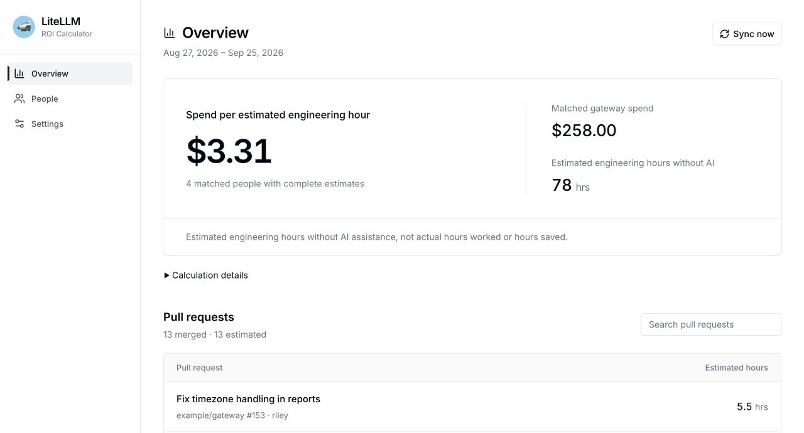
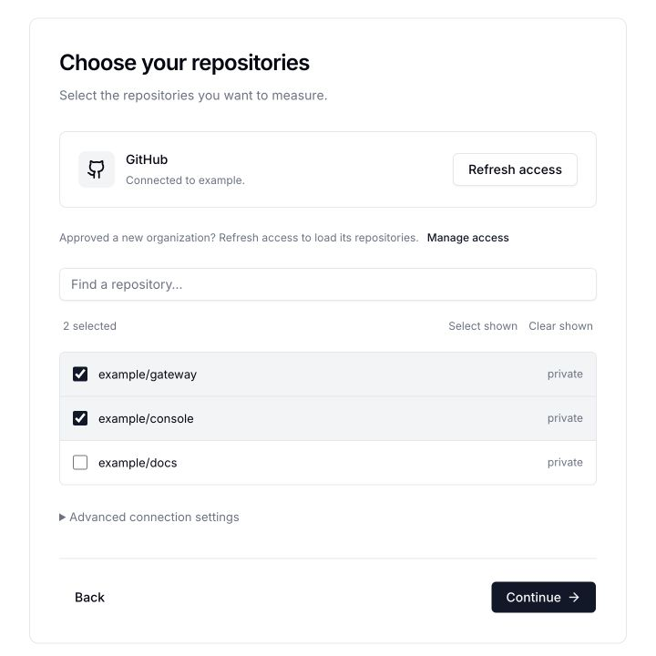
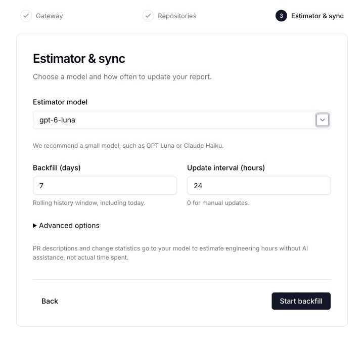
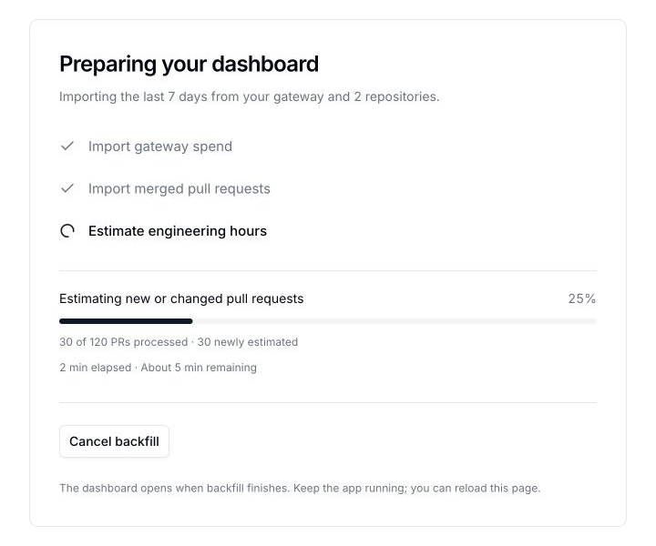

Your gateway tells you what your team spends on AI. It doesn't tell you what that spend produced.

**The [LiteLLM ROI Calculator](https://github.com/BerriAI/litellm-roi-calculator) compares gateway spend with the engineering work your team ships.** It reads spend per user from LiteLLM, estimates the effort in each merged pull request with a model you choose, and matches people by email. The result is one number: spend per estimated engineering hour.

{/* truncate */}

## Connect your gateway and GitHub

Run it locally with one command:

```bash
git clone https://github.com/BerriAI/litellm-roi-calculator.git
cd litellm-roi-calculator
uv run litellm-roi
```

The app opens at `http://localhost:8787`. There is no database server, Node installation, or frontend build.

Setup takes three steps:

- **Gateway:** enter your gateway URL and an admin or read-only admin key that can read users and spend.
- **GitHub:** click **Connect GitHub**. GitHub walks you through creating a read-only App and choosing its repositories. There are no client IDs or secrets to copy.
- **Model and schedule:** pick a model from your gateway. A small model such as GPT Luna or Claude Haiku works well.



## Estimate every merged pull request

For each merged PR, the model answers one question:

> Estimate how many hours it would take an engineer to complete the work in this pull request without AI assistance. Explain your estimate briefly.

The model sees the PR description, file change counts, and commit metadata. Code patches are never sent. Temperature is fixed at 0, and you can edit the prompt, backfill window, and update interval in **Settings**.



Click **Start backfill** and the app imports spend and PRs, then estimates up to three PRs at a time. After that it refreshes on your schedule. Unchanged PRs reuse their cached estimates, so you only pay to estimate new or changed work.



## Read the report

- **Overview:** matched spend divided by estimated hours. Click any PR to see its estimate and the model's reasoning.
- **People:** spend and estimated hours per engineer. Use **Match email** when someone's GitHub email differs from their gateway email.
- **Calculation details:** shows how much spend was matched and what was excluded.

In the sample report above, $258 of matched spend ÷ 78 estimated hours = **$3.31 per estimated hour**. These are estimates of engineering effort, not hours worked or hours saved. Each person's spend covers all of their gateway usage, not costs attributed to a specific PR.

## Host it for your team

The repository includes a Render blueprint for a single shared instance with a persistent disk. It has no built-in dashboard login, so put it behind your hosting provider's access controls or an SSO proxy before sharing company data. Keys stay on the server, and PR metadata only goes to the model you picked, through your own gateway.

## Get started

The ROI Calculator is open source under Apache 2.0. Clone [BerriAI/litellm-roi-calculator](https://github.com/BerriAI/litellm-roi-calculator), follow the README, or [explore the demo without credentials](https://github.com/BerriAI/litellm-roi-calculator/blob/main/docs/running.md).

Try it on your team's last week of PRs and [tell us what you find](https://github.com/BerriAI/litellm-roi-calculator/issues).
