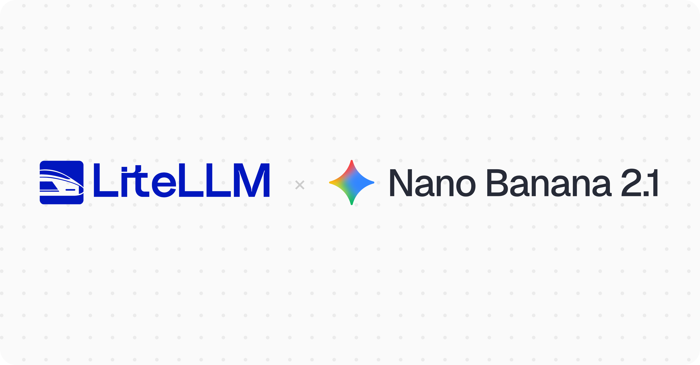

import Tabs from '@theme/Tabs';
import TabItem from '@theme/TabItem';



LiteLLM supports `gemini-nano-banana-2.1` on day 0 on Google AI Studio (`gemini/`) and Gemini Enterprise Agent Platform, formerly Vertex AI (`vertex_ai/`), through `/v1/images/generations`, `/v1/images/edits` and `/chat/completions`. It replaces Nano Banana 2 (`gemini-3.1-flash-image`), which the Gemini API shuts down on October 29, 2026.

{/* truncate */}

[Per Google](https://ai.google.dev/gemini-api/docs/models/gemini-nano-banana-2.1), Nano Banana 2.1 improves visual quality and text rendering at 1K, 2K and 4K, fixes tiling on wide aspect ratios, takes up to 14 reference images, and supports Search grounding and configurable thinking levels.

:::note
**No Docker image upgrade needed.** Hit **Reload Model Cost Map** in the Admin UI (or `POST /reload/model_cost_map`) to pull pricing, on `v1.76.0` and above.
:::

## Pricing

- Image output: $30 / MTok ($0.0336 per 1K image)
- Text input: $1.50 / MTok
- Text output: $7.50 / MTok

## Quick Start

<Tabs>
<TabItem value="proxy" label="PROXY">

**1. Setup config.yaml**

```yaml
model_list:
  - model_name: nano-banana-2.1
    litellm_params:
      model: gemini/gemini-nano-banana-2.1
      api_key: os.environ/GEMINI_API_KEY
  - model_name: nano-banana-2.1-agent-platform
    litellm_params:
      model: vertex_ai/gemini-nano-banana-2.1
      vertex_project: os.environ/VERTEX_PROJECT
      vertex_location: global
```

**2. Start the proxy**

```bash
litellm --config /path/to/config.yaml
```

**3. Test it**

```bash
curl http://0.0.0.0:4000/v1/images/generations \
  -H "Authorization: Bearer $LITELLM_KEY" \
  -H "Content-Type: application/json" \
  -d '{
    "model": "nano-banana-2.1",
    "prompt": "A product shot of a ceramic mug on a walnut desk, soft morning light"
  }'
```

</TabItem>

<TabItem value="sdk" label="SDK">

```python
import litellm

response = litellm.image_generation(
    model="gemini/gemini-nano-banana-2.1",
    prompt="A product shot of a ceramic mug on a walnut desk, soft morning light",
)

print(response.data[0].b64_json[:64])
```

</TabItem>
</Tabs>

## Feedback

Questions and feedback go in [GitHub discussion #44983](https://github.com/BerriAI/litellm/discussions/44983).
