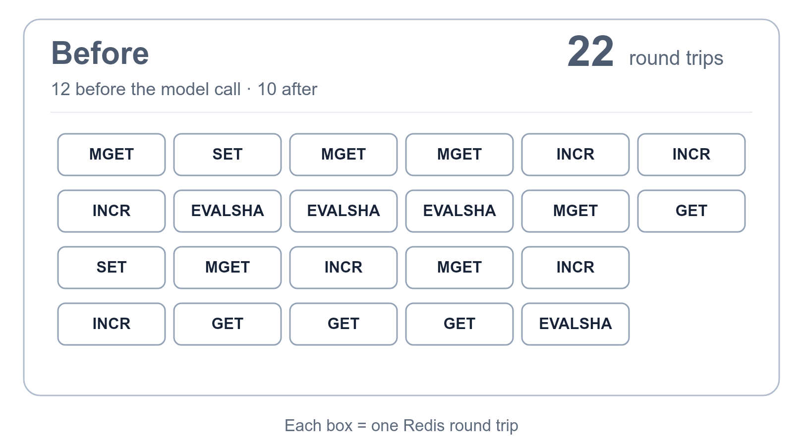

import { PerformanceResults, RoundTripTimeline, BatchLifecycle, EndpointResults } from './diagrams';

This week, we cut the number of times a request to the LiteLLM proxy waits on Redis from **22 to 8**.

A request from a key with a budget, in a team with a budget and TPM/RPM limits, against a model group with usage-based routing and a Redis response cache, made 22 Redis round trips: 12 before the model was called and 10 after. The same request, with the same checks and the same writes, now makes **5 before and 3 after**.

{/* truncate */}

<PerformanceResults />

## Why it was slow

Seven parts of the proxy talk to Redis on a request: auth, spend counters, budget reservation, the rate limiter, the router, the response cache, and the post-call accounting. Each one read what it needed, decided, wrote, and returned before the next one started. The rate limiter alone ran three Lua scripts one after another. Budget reservation re-read the spend counters auth had just read, then sent one increment per entity.

Of the 22 round trips, **5 carried information a decision depended on**: the identity rows, the spend counters, the rate-limit scripts, the routing state and the response-cache lookup. The other 17 were re-reads of values already in hand, write-backs, and counter updates nothing waited for. Redis was never the bottleneck. The cost was waiting for the answer, 22 times in a row, on every request.

<RoundTripTimeline />

## What we changed

**Every request now owns one Redis batch per backend.** Auth, the spend check, the rate limiter and the router declare their reads and scripts on it and get a handle back. The first time anyone awaits a handle, everything declared so far leaves as one pipeline, and every caller reads its own reply. The checks themselves did not move: budget rejects still happen in the budget code, rate-limit rejects in the rate limiter, in the same order as before.

<BatchLifecycle />

After the model responds, nothing waits on the writes, so they collect in a post-call batch: the response-cache write, the spend increments, the deployment usage counter and the rate limiter's token script. They leave in one pipeline when the success or failure callbacks finish. A one-second deadline flushes the batch if no callback closes it, and shutdown drains whatever is still pending, so a pod restart does not lose accounting.

Each command in a pipeline gets its own reply. A Lua script that is not loaded fails only its owner, which falls back to a direct call exactly as it did before. A pipeline that fails as a whole looks to every owner like Redis being unreachable, which they already handle. Redis Cluster clients keep making direct calls, since a cluster pipeline fans out per node. Requests that touch two Redis backends get one pipeline per backend, and the proxy and router caches share a pipeline when they point at the same server.

## Redis round trips per request: 22 → 8

The same harness ran every endpoint shape the proxy governs the same way, with and without streaming, with usage-based and simple-shuffle routing, and with a response-cache hit. `/v1/responses` keeps one extra round trip on each side because its native handler still makes two synchronous cache calls from a worker thread.

<EndpointResults />

## Auth refresh requests: 46 → 16 Redis round trips

Auth keeps its management objects, the key, the end user, the team and the model-access registry, in memory for 60 seconds. On the first request after they expire, the proxy refreshed each one from Redis and then Postgres one call at a time: 16 serial Redis trips before routing started, the end user, the key and the registry each read twice, and the team alias deleted with a synchronous call on the event loop. That request cost 46 round trips instead of 22, once a minute for every active key.

The same request now reads whatever memory is missing with one MGET on the request pipeline, reads the team, and sends the write-backs and the alias delete as one pipeline behind it. The refresh is 3 trips, and the request as a whole went from **46 to 16 round trips** for chat and from 40 to 14 for `/v1/messages`.

## How we measured

We measured both versions on the same local proxy, from the commit before this work (`27c110cb`) to main with all five changes in it (`13d004fc`): Redis 6.0 and Postgres 14, mock deployments so the count does not depend on a provider, and a tracer that logs every Redis call and every pipeline flush with its caller. A pipeline or a Lua script counts as one round trip. Every sample was preceded by a warm-up request 12 seconds earlier, and the harness idles for 65 seconds every three samples so the 60-second cache expiry never lands inside a sample. For the refresh case, the harness sent a warm-up request, waited 65 seconds and traced the next one. All requests returned HTTP 200 in both arms.

See the changes: [routing reads](https://github.com/BerriAI/litellm/pull/43320), [spend counters](https://github.com/BerriAI/litellm/pull/43369), [the pre-call pipeline](https://github.com/BerriAI/litellm/pull/43407), [the post-call pipeline](https://github.com/BerriAI/litellm/pull/43779) and [the auth refresh](https://github.com/BerriAI/litellm/pull/43776).
