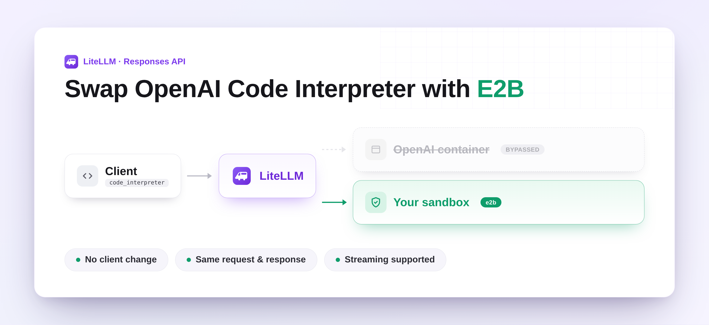

import Tabs from '@theme/Tabs';
import TabItem from '@theme/TabItem';



The OpenAI Responses and Chat Completions APIs let you declare a `code_interpreter` tool and the model runs Python inside an OpenAI-hosted container. That container is opaque, billed by OpenAI, and the code (often customer data) leaves your perimeter. LiteLLM now let's you intercept that tool call and runs it in a sandbox you control. The client request is unchanged.

Available starting `LiteLLM v1.91.0.dev1`. Check here for [releases](https://github.com/BerriAI/litellm/releases).

{/* truncate */}

## How the swap works

Register a sandbox tool, enable the interceptor, then call the model the way you already do. When the model emits a `code_interpreter` tool call, LiteLLM creates a sandbox (E2B or OpenSandbox), executes the generated code, feeds the result back into the loop, and tears the sandbox down on completion. The response shape stays compatible with OpenAI's native `code_interpreter_call`.

Two backends are supported today: [E2B](https://e2b.dev/) for a managed sandbox, and [OpenSandbox](https://github.com/opensandboxai/opensandbox) for self-hosted Docker-backed execution when the code or data cannot leave your network.

## SDK

<Tabs>
<TabItem value="responses" label="Responses API">

```python
import os, litellm
from litellm.sandbox.sandbox_tools import register_sandbox_tools
from litellm.integrations.code_interpreter_interception.handler import (
    CodeInterpreterInterceptionLogger,
)

os.environ["E2B_API_KEY"] = "e2b_..."
os.environ["OPENAI_API_KEY"] = "sk-..."

register_sandbox_tools([
    {
        "sandbox_tool_name": "my-e2b",
        "litellm_params": {
            "sandbox_provider": "e2b",
            "api_key": "os.environ/E2B_API_KEY",
        },
    }
])

litellm.callbacks = [
    CodeInterpreterInterceptionLogger(sandbox_tool_name="my-e2b")
]

response = await litellm.aresponses(
    model="openai/gpt-5",
    tools=[{"type": "code_interpreter", "container": {"type": "auto"}}],
    input="Product of first 6 primes. Just the number.",
)
print(response.output_text)
```

</TabItem>
<TabItem value="chat" label="Chat Completions">

```python
import os, litellm
from litellm.sandbox.sandbox_tools import register_sandbox_tools
from litellm.integrations.code_interpreter_interception.handler import (
    CodeInterpreterInterceptionLogger,
)

os.environ["E2B_API_KEY"] = "e2b_..."
os.environ["OPENAI_API_KEY"] = "sk-..."

register_sandbox_tools([
    {
        "sandbox_tool_name": "my-e2b",
        "litellm_params": {
            "sandbox_provider": "e2b",
            "api_key": "os.environ/E2B_API_KEY",
        },
    }
])

litellm.callbacks = [
    CodeInterpreterInterceptionLogger(sandbox_tool_name="my-e2b")
]

response = await litellm.acompletion(
    model="openai/gpt-4o-mini",
    messages=[{"role": "user", "content": "Product of first 6 primes. Just the number."}],
    tools=[{"type": "code_interpreter", "container": {"type": "auto"}}],
    max_agentic_loops=4,
)
print(response.choices[0].message.content)
```

</TabItem>
</Tabs>

The native `code_interpreter` tool is rewritten before it reaches OpenAI; on the chat path it becomes a `litellm_code_execution` function tool and LiteLLM appends each sandbox result as a `role: tool` message until the model returns a final answer.

## Proxy

Same swap behind the AI gateway, with no client-side change.

```yaml title="config.yaml"
model_list:
  - model_name: gpt-5
    litellm_params:
      model: openai/gpt-5
      api_key: os.environ/OPENAI_API_KEY

sandbox_tools:
  - sandbox_tool_name: my-e2b
    litellm_params:
      sandbox_provider: e2b
      api_key: os.environ/E2B_API_KEY

litellm_settings:
  callbacks: ["code_interpreter_interception"]
  code_interpreter_interception_params:
    sandbox_tool_name: my-e2b
```

The OpenAI SDK keeps working unchanged. Point it at the proxy, declare `code_interpreter`, and the gateway handles the rest.

```python
from openai import OpenAI

client = OpenAI(api_key="sk-1234", base_url="http://localhost:4000/v1")

response = client.responses.create(
    model="gpt-5",
    tools=[{"type": "code_interpreter", "container": {"type": "auto"}}],
    input="Product of first 6 primes. Just the number.",
)
print(response.output_text)
```

To run fully on-prem, swap the `sandbox_tools` entry to OpenSandbox:

```yaml
sandbox_tools:
  - sandbox_tool_name: my-opensandbox
    litellm_params:
      sandbox_provider: opensandbox
      api_base: os.environ/OPEN_SANDBOX_API_BASE
      api_key: os.environ/OPEN_SANDBOX_API_KEY
```

OpenSandbox runs sandboxes locally with egress denied by default; flip `allow_internet_access=True` or pass an explicit `network_policy` when the code needs the network.

## Why route it through your own sandbox

You keep the OpenAI client contract while owning the execution layer. The generated code and any uploaded data stay inside the sandbox you operate, billing for execution stops going to OpenAI, and the same setup works for Responses and Chat Completions across any model the gateway routes to. Streaming, forced `tool_choice`, and concurrent requests are isolated per request and cleaned up on completion.

Full reference is in the [sandbox docs](/docs/sandbox).
