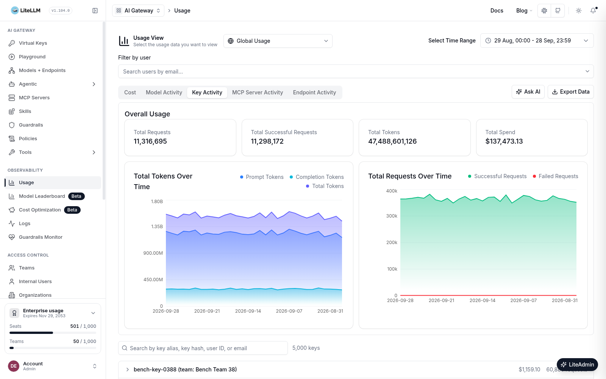

import { PerformanceResults, UsageDataFlow } from './diagrams';

This week, we made the LiteLLM Usage page roughly 120x faster.

With 5,000 API keys, our Usage page took **over six minutes** to show 30 days of totals. We redesigned how it loads data and brought that down to **3.2 seconds** in our benchmark. That's roughly **120x faster**.

{/* truncate */}

<PerformanceResults />

## Why it was slow

The browser downloaded every key's daily usage, 1,000 rows at a time, then calculated totals and rankings in JavaScript.

More keys and more history meant more requests, more data, and more work in the browser. Our 30-day test needed **315 requests and 1.3 GB of data** before the totals appeared.

## What we changed

**Postgres now does the aggregation.** The page receives calculated totals and usage breakdowns, instead of downloading every key's history to calculate them.

<UsageDataFlow />

Totals still include **all keys** in the selected range. The key list loads 50 keys at a time as you scroll, and a key's daily charts load when you expand it, so the browser never holds every key's history. Search and CSV export run in Postgres too, so you can still find any virtual key and export complete usage data.

## The results hold up over longer ranges

For 90 days of usage, time to totals fell from **about 34 minutes to 10 seconds**. The same redesign covers the User, Agent, Team, Tag, Organization, and Customer usage views.

We tested both designs against the same Postgres database: **5,000 API keys and 4.9 million daily rows across 91 days**. Both used production UI builds. New timings are medians of five runs with a cold browser cache; old timings come from runs allowed to finish beyond our 90-second cutoff. These measurements track time to visible totals. We later reran the final code side by side with the version we first measured, on a separate machine, and time to totals matched within 2%.

See the changes: [database queries](https://github.com/BerriAI/litellm/pull/43398), [API routes](https://github.com/BerriAI/litellm/pull/43408), and [Admin UI](https://github.com/BerriAI/litellm/pull/43409). We're making it faster to see where your LLM spend is going, even as your deployment grows.
