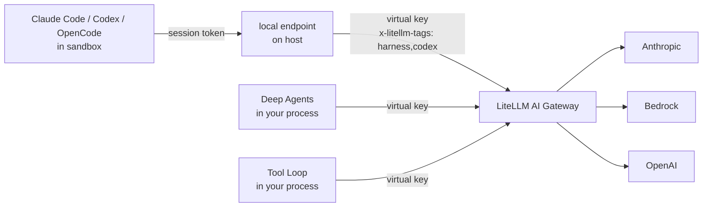

# Using with LiteLLM AI Gateway

The recommended way to run an agent with `litellm.agent()` is against a [LiteLLM AI Gateway](/docs/proxy/docker_quick_start). Claude Code, Codex, OpenCode, Deep Agents and Tool Loop use different model APIs and ways to pass credentials. With the gateway they share one virtual key, the same model groups and fallbacks, and every call lands in the gateway's spend logs tagged with the harness that made it

The CLI runtimes only see a per-session token for a local endpoint on your host, and that endpoint adds your virtual key when it forwards to the gateway. Deep Agents and Tool Loop call the gateway from your Python process with the virtual key. Provider keys live on the gateway and never reach your machine

## How requests flow



Every forwarded request carries `x-litellm-tags: harness,<name>` (see [request tags](/docs/proxy/request_tags)), where `<name>` is `claude_code`, `codex`, `opencode`, `deepagents` or `tool_loop`, and your `metadata=` is sent as `x-litellm-spend-logs-metadata`. The `model` in each request is rewritten to the model group you passed, so a runtime's own default model name never reaches the gateway

## 1. Configure the gateway

Give each kind of harness a model group that suits it. Claude Code is tuned for Claude, Codex for OpenAI reasoning models, and OpenCode, Deep Agents and Tool Loop work with any group that supports their API

```yaml title="config.yaml"
model_list:
  # Claude, load-balanced across Anthropic and Bedrock
  - model_name: claude
    litellm_params:
      model: anthropic/claude-sonnet-4-5
      api_key: os.environ/ANTHROPIC_API_KEY
  - model_name: claude
    litellm_params:
      model: bedrock/us.anthropic.claude-sonnet-4-5-20250929-v1:0
      aws_region_name: us-west-2
  - model_name: claude-haiku
    litellm_params:
      model: anthropic/claude-haiku-4-5
      api_key: os.environ/ANTHROPIC_API_KEY
  # OpenAI reasoning model with native Responses API support
  - model_name: gpt
    litellm_params:
      model: openai/gpt-5
      api_key: os.environ/OPENAI_API_KEY
  # a cheaper general model for OpenCode, Deep Agents and Tool Loop
  - model_name: gemini
    litellm_params:
      model: gemini/gemini-2.5-pro
      api_key: os.environ/GEMINI_API_KEY

router_settings:
  fallbacks: [{"claude": ["gpt"]}, {"gpt": ["claude"]}]

general_settings:
  master_key: os.environ/LITELLM_MASTER_KEY
  database_url: os.environ/DATABASE_URL
```

```bash
litellm --config config.yaml --port 4000
```

The gateway exposes every group on `/v1/messages`, `/v1/responses` and `/v1/chat/completions`, and translates between formats when a harness calls a group from another provider. A database is needed for virtual keys and spend logs.

## 2. Create a virtual key

```bash
curl -X POST http://localhost:4000/key/generate \
  -H "Authorization: Bearer $LITELLM_MASTER_KEY" \
  -H "Content-Type: application/json" \
  -d '{"models": ["claude", "claude-haiku", "gpt", "gemini"], "key_alias": "agents", "max_budget": 50}'
```

The response contains a `key` starting with `sk-`. The key can only call the groups in `models`, and stops working once it has spent `max_budget` dollars. See [Virtual keys](/docs/proxy/virtual_keys) for rate limits and team keys.

## 3. Point litellm.agent() at it

Gateway calls follow the same convention as `litellm.completion`: prefix the model group with `litellm_proxy/` and set the gateway's address and key.

```bash
export LITELLM_PROXY_API_BASE=http://localhost:4000
export LITELLM_PROXY_API_KEY=sk-...
```

```python
import litellm
from litellm import Harness, sandbox

result = litellm.agent(
    Harness.CLAUDE_CODE,
    "Find why tests/test_router.py is flaky and fix it.",
    sandbox=sandbox.local("./repo"),
    model="litellm_proxy/claude",
)
```

You can pass `api_base=` and `api_key=` on the call instead of using the environment. `api_base` is the gateway root, without `/v1`. Setting `litellm.use_litellm_proxy = True` sends every call through the gateway, even without the prefix. A model without the prefix is otherwise called directly through the LiteLLM SDK (see [Without a gateway](#without-a-gateway)).

## 4. Choosing a harness

All five harnesses take the same call, but they are good at different jobs and use the gateway route that fits each runtime

| Harness | Gateway route | Best model group | Pick it for |
|---|---|---|---|
| Claude Code | `/v1/messages` | Claude (Anthropic, Bedrock or Vertex) | long, multi-file changes in a real repo |
| Codex | `/v1/responses` | OpenAI reasoning model | hard, well-specified tasks where reasoning depth pays off |
| OpenCode | `/v1/chat/completions` | any | running a coding agent on non-Claude or self-hosted models |
| Deep Agents | `/v1/chat/completions` via `litellm_proxy/` | any | agents that call your own Python functions |
| Tool Loop | `/v1/chat/completions` via `litellm_proxy/` | any tool-calling model | a minimal loop around your own Python functions |

### Claude Code

Claude Code is the most capable general coding agent of the CLI harnesses. It plans, reads widely before editing, runs tests and recovers from its own mistakes, which makes it the default for refactors, bug hunts and changes that span many files. It is also the most expensive per task

Its prompts are written for Claude, so point it at a Claude group. Bedrock and Vertex Claude behave the same as Anthropic direct; other models work through gateway translation but lose quality. Use `permissions="edit"` on your laptop, or `"full"` inside `sandbox.docker` when it needs to install packages and run the suite.

```python
litellm.agent(
    Harness.CLAUDE_CODE,
    "Fix the flaky test in tests/test_router.py without editing the test.",
    sandbox=sandbox.local("./repo"),
    model="litellm_proxy/claude",
    permissions="edit",
)
```

### Codex

Codex is strongest on self-contained, well-specified problems where a reasoning model can think hard before acting: migrations, tricky algorithms, making a failing suite pass. It is weaker at open-ended exploration, and it can't turn off individual built-in tools.

It speaks the Responses API, so the best fit is an OpenAI group like `gpt`. Other providers work because the gateway translates Responses into their native format, though Codex-specific features such as reasoning summaries may not survive. Codex supports only `"read-only"` and `"full"`, so run changes inside `sandbox.docker`.

```python
litellm.agent(
    Harness.CODEX,
    "Upgrade pydantic to v2 and make the test suite pass.",
    sandbox=sandbox.docker("my-agents:latest", mounts={"./repo": "/workspace"}),
    model="litellm_proxy/gpt",
    options=CodexOptions(reasoning_effort="high"),
)
```

### OpenCode

OpenCode is a capable coding agent that works with any model. It is the right pick when you want an agent loop on Gemini, Qwen, DeepSeek, a fine-tune or a self-hosted vLLM group. Its tool use is less polished than Claude Code's on long tasks.

It speaks plain Chat Completions, so any group works without translation. `"edit"` is a good default, and OpenCode enforces it through its own permission config.

```python
litellm.agent(
    Harness.OPENCODE,
    "Add a /health endpoint with a test.",
    sandbox=sandbox.local("./api"),
    model="litellm_proxy/gemini",
    permissions="edit",
)
```

### Deep Agents

Deep Agents and Tool Loop both run in your process, call your Python functions and support `s.history()`. Deep Agents also has built-in file and shell tools, which makes it useful when a task combines your internal APIs with sandbox access. It is less polished at pure coding than the CLI agents

It calls the gateway directly with `litellm_proxy/<group>` and never uses the local endpoint, and it works with any group that supports tool calling. Its file and shell tools act on the sandbox; use `"edit"` unless it needs a shell.

```python
litellm.agent(
    Harness.DEEPAGENTS,
    "File a ticket with the right owner for each flaky test.",
    sandbox=sandbox.local("./repo"),
    model="litellm_proxy/claude",
    tools=[lookup_owner, open_ticket],
    permissions="edit",
)
```

### Tool Loop

Tool Loop is a minimal in-process loop around `litellm.acompletion()`. Use it when your task can be handled by your own Python functions and you don't need built-in file or shell tools

```python
litellm.agent(
    Harness.TOOL_LOOP,
    "Search the repository and summarize the relevant changes.",
    sandbox=sandbox.local("./repo"),
    model="litellm_proxy/coder",
    tools=[search_code, read_file],
)
```

The gateway sees Chat Completions requests tagged `harness,tool_loop`. See [Tool Loop](./tool_loop.md) for its SDK, options and permission behavior

## 5. Comparing harnesses

Each harness's requests carry its own tag, so if you try more than one on the same kind of task, the gateway already has the numbers to compare spend, request count and failure rate per harness. Pass a shared `metadata={"experiment": "..."}` to group the runs.

## 6. See spend by harness

In the gateway UI, open **Usage** and switch to the tag view. Each harness shows up as its own tag (`claude_code`, `codex`, `opencode`, `deepagents`, `tool_loop`) next to the shared `harness` tag. The same data is available from the API

```bash
# daily spend and tokens for each harness tag
curl "http://localhost:4000/tag/daily/activity?tags=claude_code,codex,opencode,deepagents,tool_loop&start_date=2026-09-01&end_date=2026-09-30" \
  -H "Authorization: Bearer $LITELLM_MASTER_KEY"

# individual requests made with the agents key
curl "http://localhost:4000/spend/logs?api_key=sk-...&start_date=2026-09-30&end_date=2026-10-01&summarize=false" \
  -H "Authorization: Bearer $LITELLM_MASTER_KEY"
```

Each spend log row has `request_tags` set to `["harness", "codex"]` (or the matching harness) and your `metadata=` under `metadata.spend_logs_metadata`, so you can filter by a run id or a user id you passed in. `result.cost` comes from the gateway's `x-litellm-response-cost` header, so it matches what the gateway records.

## Without a gateway

Without the `litellm_proxy/` prefix, the model is called directly through the LiteLLM SDK. Set the usual provider variable on your host and pass a full LiteLLM model string.

```python
result = litellm.agent(
    Harness.CODEX,
    "Add type hints to utils.py",
    sandbox=sandbox.local("./repo"),
    model="anthropic/claude-sonnet-4-5",  # reads ANTHROPIC_API_KEY on the host
)
```

CLI harnesses still use the per-session endpoint to keep provider keys on the host. In-process harnesses call the LiteLLM SDK from your Python process. Cost is computed locally from LiteLLM's model cost map. You lose central spend logs, shared keys and gateway-side fallbacks. See [Models and routing](./models.md#sdk-mode) for details
