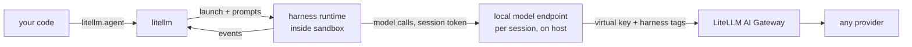

# Agents (`litellm.agent`)

:::info Beta
`litellm.agent()` is in beta. The API may change between releases.
:::

Run an agent with `litellm.agent()` to drive Claude Code, Codex, OpenCode, Deep Agents or Tool Loop from Python with one API. Route model calls through the LiteLLM AI Gateway so all five harnesses can share one virtual key, one set of model groups and fallbacks, and one place to see spend

```python title="fix_flaky.py"
import litellm
from litellm import Harness, sandbox

# LITELLM_PROXY_API_BASE and LITELLM_PROXY_API_KEY point at your gateway
result = litellm.agent(
    Harness.CLAUDE_CODE,
    "Find why tests/test_router.py is flaky and fix it.",
    sandbox=sandbox.local("./repo"),
    model="litellm_proxy/claude",  # a model group on the gateway
)

print(result.text)
print(result.cost)         # 0.4137
for f in result.files:
    print(f.kind, f.path)  # modified tests/test_router.py
```

The `litellm_proxy/` prefix works the same way it does for `litellm.completion`: the call goes to the gateway at `LITELLM_PROXY_API_BASE` with the virtual key in `LITELLM_PROXY_API_KEY`, or at the `api_base=` and `api_key=` you pass. To run the same task on Codex, change `Harness.CLAUDE_CODE` to `Harness.CODEX`. Streaming is `litellm.agent(..., stream=True)`, async is `await litellm.aagent(...)`, and multi-turn work uses `litellm.agent_session()`.

See [Using with LiteLLM AI Gateway](./gateway.md) for the proxy config, virtual keys, which harness to pick, and spend by harness. Without the prefix, the model is called directly through the LiteLLM SDK; see [Models and routing](./models.md#sdk-mode).

## Supported harnesses

| Harness | Runtime | Runs in |
|---|---|---|
| [`Harness.CLAUDE_CODE`](./claude_code.md) | Anthropic's Claude Code CLI | your sandbox |
| [`Harness.CODEX`](./codex.md) | OpenAI's Codex CLI | your sandbox |
| [`Harness.OPENCODE`](./opencode.md) | OpenCode CLI | your sandbox |
| [`Harness.DEEPAGENTS`](./deepagents.md) | LangChain Deep Agents | your Python process, tools act on your sandbox |
| [`Harness.TOOL_LOOP`](./tool_loop.md) | LiteLLM tool-calling loop | your Python process, calls your tools |

[Supported harnesses](./supported.md) has the full capability table.

## What a harness is

A harness gives you a defined way to run agent turns, with capabilities that vary by harness. `litellm.agent()` starts the runtime, sends it prompts, and turns what it does into typed Python events. Tool Loop handles model tool calls for your Python functions without adding built-in file or shell tools

With `litellm.completion` you get one model call and write the loop yourself. With a harness you get a finished loop that somebody else maintains. Use a harness when you want a coding agent working on a repo or a container, and `completion` when you need exact control over each model call.

## How it works



For each session, `litellm.agent()` starts a small model endpoint on the host and points the runtime at it with the runtime's own base URL setting, such as `ANTHROPIC_BASE_URL` for Claude Code. The runtime gets a random token that only works for that session. The endpoint forwards each request to the gateway with your virtual key and tags it `harness,<name>`. Neither your virtual key nor any provider key enters the sandbox.

Deep Agents and Tool Loop run in your process and don't need the local endpoint. Deep Agents uses a `ChatLiteLLM` model, while Tool Loop calls `litellm.acompletion()`

## Core concepts

`Harness` is an enum of the supported runtimes. It's a plain `Enum`, and passing a string like `"codex"` raises `TypeError` with a hint pointing at `Harness.CODEX`.

A `Sandbox` is required by every call. CLI harnesses run there, but Python tools for in-process harnesses run in your process and are not restricted by the sandbox automatically. In this release CLI runtime binaries must already be installed in the sandbox

A `Session` is a live runtime with its sandbox, working directory and history. `litellm.agent()` opens one for a single turn and closes it after. `litellm.agent_session()` keeps it open across turns.

An `Event` is one of eight frozen dataclasses: `Text`, `Reasoning`, `ToolCall`, `ToolResult`, `FileChange`, `Compaction`, `Approval` and `Done`. The set is closed, so a `match` statement over it can be exhaustive.

## Install

`litellm.agent()` ships in the normal `litellm` package and adds no dependencies to it. You install only what the harness you use needs; the [Quickstart](./quickstart.md#1-install) has the table.
