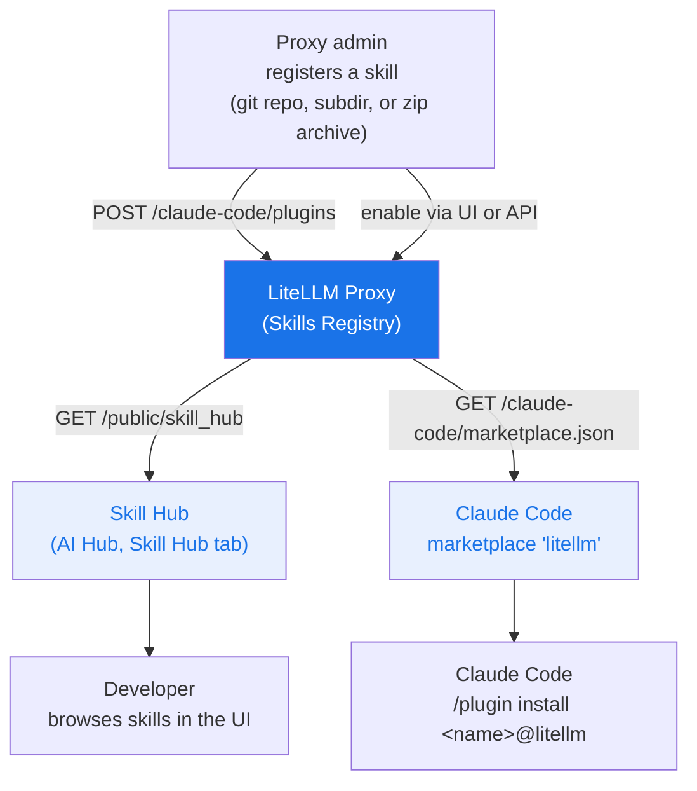

# Skills Gateway

<iframe width="840" height="500" src="https://www.loom.com/embed/cb74eb79df3e4c2b83a6efae54a589f9" frameBorder="0" allowFullScreen></iframe>

LiteLLM acts as a **Skills Registry**, a central place to register, manage, and discover Claude Code skills across your organization. Teams publish a skill once, and developers and agents find it through a single hub and install it from one Claude Code marketplace.

## How it works



Enabled skills are public: they appear in the Skill Hub and in `marketplace.json` for anyone who can reach the proxy. Disabled skills are private and only reach keys or teams that were granted them (see [Private skills](#private-skills)). New skills are enabled as soon as they are registered, so disable one to keep it private. Only proxy admins can create, update, enable, disable, or delete skills; any other key is rejected with a `401` or `403`.

## Quick start

### 1. Register a skill

In the Admin UI open **Skills**, click **+ Add Skill**, and paste a GitHub URL, a git clone URL (HTTPS or SSH), or an HTTPS link to a zip file. LiteLLM detects the source type and suggests a skill name, including for skills nested in a subdirectory such as `github.com/org/repo/tree/main/skills/my-skill`.

Or register it through the API with an admin key:

```bash
curl -X POST https://your-proxy/claude-code/plugins \
  -H "Authorization: Bearer $LITELLM_MASTER_KEY" \
  -H "Content-Type: application/json" \
  -d '{
    "name": "grill-me",
    "source": {
      "source": "git-subdir",
      "url": "https://github.com/mattpocock/skills",
      "path": "skills/productivity/grill-me"
    },
    "description": "Interview skill for relentless questioning",
    "domain": "Productivity",
    "namespace": "interviews"
  }'
```

`POST` only creates. Registering a name that already exists returns `409`; change an existing skill with `PUT /claude-code/plugins/{name}` instead.

### 2. Publish or unpublish

A newly registered skill is already enabled and public. To change which skills are public, use the Admin UI: **AI Hub → Skill Hub → Select Skills to Make Public**.

Or the API, with `/disable` to unpublish and `/enable` to publish again:

```bash
curl -X POST https://your-proxy/claude-code/plugins/grill-me/disable \
  -H "Authorization: Bearer $LITELLM_MASTER_KEY"
```

### 3. Browse the hub

Public skills appear in the Admin UI under **AI Hub → Skill Hub**, on the public page at `/ui/model_hub` under the **Skill Hub** tab (no login required), and through the API at `GET /public/skill_hub`.

### 4. Install in Claude Code

Add the proxy marketplace once. The marketplace is always named `litellm`:

```
/plugin marketplace add https://your-proxy/claude-code/marketplace.json
```

Then install any skill by `<name>@litellm`:

```
/plugin install grill-me@litellm
```

The same commands work from a shell as `claude plugin marketplace add <url>` and `claude plugin install grill-me@litellm`.

To roll the marketplace out through settings instead, add it to `extraKnownMarketplaces`. The `source` value is an object; a flat `"source": "url"` entry is rejected by Claude Code as an invalid marketplace entry and ignored:

```json title="~/.claude/settings.json"
{
  "extraKnownMarketplaces": {
    "litellm": {
      "source": {
        "source": "url",
        "url": "https://your-proxy/claude-code/marketplace.json"
      }
    }
  }
}
```

## Private skills

A disabled skill stays out of the Skill Hub and the anonymous `marketplace.json`, but you can grant it to specific keys or teams through `object_permission.skills`. In the Admin UI use **Allowed Skills** when creating or editing a key or team. Through the API:

```bash
curl -X POST https://your-proxy/key/generate \
  -H "Authorization: Bearer $LITELLM_MASTER_KEY" \
  -H "Content-Type: application/json" \
  -d '{"object_permission": {"skills": ["internal-runbook"]}}'
```

When both the key and its team list skills, the key gets the intersection of the two lists; otherwise it gets whichever list is set. Developers add the key to the marketplace URL so their granted skills show up next to the public ones:

```
/plugin marketplace add "https://your-proxy/claude-code/marketplace.json?key=sk-..."
```

`GET /claude-code/plugins` and `GET /claude-code/plugins/{name}` apply the same rule: a non-admin key sees enabled skills plus the ones granted to it, and gets a `403` for a disabled skill it was not granted. Proxy admins see everything.

## Skill fields

| Field | Description |
|-------|-------------|
| `name` | Unique kebab-case identifier (`^[a-z0-9-]+$`), used in `/plugin install <name>@litellm`. Set on create and fixed afterwards |
| `source` | Where Claude Code fetches the skill from; see [Source formats](#source-formats) |
| `description` | Short description shown in the hub |
| `domain` | Top-level grouping in the Skill Hub (e.g. `Engineering`, `Productivity`) |
| `namespace` | Sub-grouping within a domain (e.g. `quality`, `meetings`) |
| `category` | Category shown in the marketplace |
| `keywords` | Tags for search and filtering |
| `version` | Semver string; defaults to `1.0.0` on create |
| `author` | `{"name": "...", "email": "..."}` |
| `homepage` | Homepage URL |

## Source formats

| `source.source` | Required fields | Example |
|-----------------|-----------------|---------|
| `github` | `repo` | `{"source": "github", "repo": "org/repo"}` |
| `url` | `url` | `{"source": "url", "url": "https://gitlab.com/org/repo.git"}` |
| `git-subdir` | `url`, `path` | `{"source": "git-subdir", "url": "https://github.com/org/repo.git", "path": "skills/my-skill"}` |
| `archive` | `url` (HTTPS), optional `sha256` | `{"source": "archive", "url": "https://bucket.s3.amazonaws.com/my-skill.zip", "sha256": "<64 hex chars>"}` |

`git-subdir` paths must be relative slash-separated segments of letters, digits, dots, hyphens, and underscores. `archive` URLs must use HTTPS, and `sha256`, when present, must be a 64-character hex digest. Claude Code downloads from these sources on the developer's machine, so private repositories and archives need credentials there.

## API reference

| Endpoint | Auth | Description |
|----------|------|-------------|
| `POST /claude-code/plugins` | Proxy admin | Create a skill (`409` if the name exists) |
| `GET /claude-code/plugins` | Any key | List the skills visible to the caller. `?enabled_only=true` returns only public skills |
| `GET /claude-code/plugins/{name}` | Any key | Get one skill (`403` if it is disabled and not granted to the caller) |
| `PUT /claude-code/plugins/{name}` | Proxy admin | Replace a skill. Omitted fields reset to their defaults, and `version` is cleared if omitted |
| `POST /claude-code/plugins/{name}/enable` | Proxy admin | Publish a skill |
| `POST /claude-code/plugins/{name}/disable` | Proxy admin | Unpublish a skill |
| `DELETE /claude-code/plugins/{name}` | Proxy admin | Delete a skill |
| `GET /public/skill_hub` | None | List public skills |
| `GET /claude-code/marketplace.json` | None, or `?key=` | Claude Code marketplace manifest. `?key=` adds the disabled skills granted to that key |

## Agent Skills discovery index

Skills uploaded to the proxy's own store through [`/v1/skills`](./skills.md) with `custom_llm_provider=litellm_proxy` can also be published as an [Agent Skills](https://agentskills.io) discovery index, so any agent that supports the format can install them with `npx skills add`. This store is separate from the Claude Code marketplace above: plugins registered through `/claude-code/plugins` do not appear in it.

The index is off by default because discovery clients send no credentials, so turning it on publishes every stored skill to anyone who can reach the proxy:

```yaml title="config.yaml"
litellm_settings:
  public_skills_index: true
```

With it on, the proxy serves the index at `GET /.well-known/agent-skills/index.json` (also at `/.well-known/skills/index.json`) and each skill as a zip at `GET /v1/skills/{skill_id}/archive`. All three routes return `404` while the setting is off. Install from a client with:

```bash
npx skills add https://your-proxy -a claude-code
```
