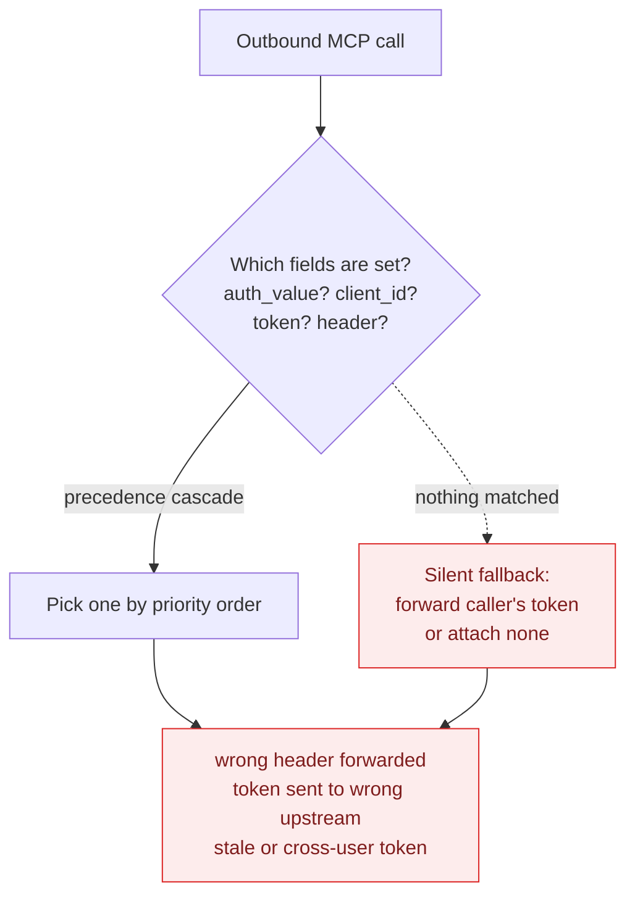
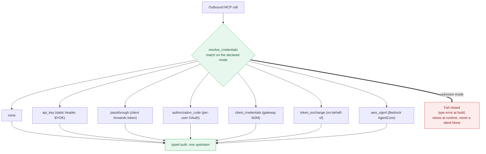
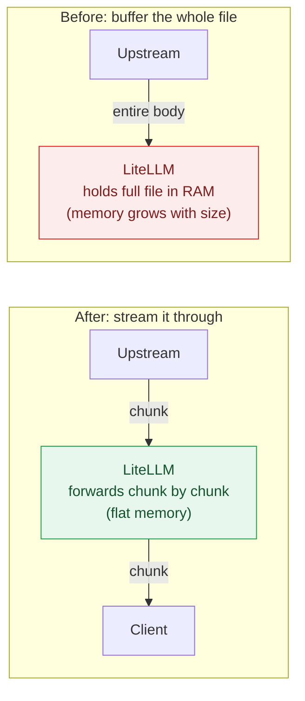

# Source document

This concept mirrors [`blog/two_week_stability_update/index.md`](https://github.com/BerriAI/litellm-docs/blob/main/blog/two_week_stability_update/index.md) from Git revision `038c9caf294fea449d24d6a787f9eaf7e3ca882f`.

The original file is preserved below so the OKF bundle remains a portable, inspectable representation of the repository documentation.

## Original content

````markdown
---
slug: two-week-stability-update
title: "July stability update: hardening MCP auth and cutting pass-through memory"
date: 2026-07-11T12:00:00
authors:
  - ishaan
  - tin
  - mateo
  - yassin
description: "A two-week product quality update. We addressed two major issues (MCP credential resolution and pass-through memory) and shipped 134 bug fixes in total. Plus our next goal: 95% end-to-end test coverage."
tags: [stability, mcp, performance, product]
hide_table_of_contents: false
---

Over the last two weeks we addressed two major product quality issues:

1. The MCP Gateway did not have a single class for credential resolution.
2. Pass-through APIs had high memory consumption.

Across the same window we shipped 134 bug fixes in total. This post covers the two big changes first, then the rest of the AI Eng and reliability work, the full breakdown, and what we are doing next.

{/* truncate */}

## MCP Gateway: a single credential resolver

The MCP Gateway connects a user's AI app (Claude Desktop, Cursor, an agent) to the upstream MCP servers it wants to use, and it has to attach the right credential for each upstream.

Before, the MCP Gateway would infer the authentication method a user was trying to use based on the credentials they set. We have now built a credential resolver class that lets a user explicitly specify which auth method they are using. We believe this will significantly drive down a class of bugs users were reporting on MCPs.

### Before: infer the auth method from whatever credentials are set



Why this was bad: there was no single place that decided which credential to attach, and no error when the decision was ambiguous. Inferring from set fields meant two code paths could read the same server and disagree. The precedence order meant adding a field could silently change which credential won. And the silent fallback meant an unhandled case still sent something upstream instead of refusing. Ambiguity resolved to "attach a credential anyway" instead of "stop."

The types of bugs we saw from this:

- Tokens sent to the wrong upstream server.
- Duplicate or stale `Authorization` headers slipping through.
- MCP requests skipping the normal team, route, and key checks.
- Cached OAuth tokens going stale or crossing between users.
- Upstream URLs and secrets showing up in logs.

### After: the user declares the auth method, and it fails closed



Each mode has its own fully typed config, so there is no guessing from which fields are set and no precedence order. The match is exhaustive, so adding a mode without handling it fails the type checker, and an unhandled case raises instead of quietly attaching no auth.

## AI Eng: LLM providers (27 fixes)

AI Eng was focused on driving down reported bugs. Most of them were on new models (Claude 4.8, Opus 4.8, Bedrock Invoke). Here are the types of bugs we fixed:

| Type of bug | Count |
|---|---|
| New model capabilities getting dropped | 10 |
| Wrong cost or billing | 6 |
| Routing or fallback picking the wrong model | 6 |
| Broken response or streaming output | 5 |
| Total | 27 |

Most of these were on Bedrock and the routing layer.

## Performance: pass-through memory

Pass-through APIs had high memory consumption. Large non-JSON pass-through downloads (batch-result files, binary and octet-stream downloads) were buffered whole in memory before being sent on. We changed this to stream the response chunk by chunk, so memory stays flat regardless of file size ([#32386](https://github.com/BerriAI/litellm/pull/32386)). This covers the provider pass-through routes (`/vertex_ai/*`, `/bedrock/*`, `/openai/*`, `/anthropic/*`, and others) and custom pass-through endpoints.



JSON responses still buffer by design, so spend logging and guardrails can inspect the body.

Two more fixes in the same spirit, don't pay for work nobody needs:

- Prometheus skips budget-metric DB lookups entirely when the gauges are no-ops (nothing is scraping them).
- The complexity router builds its semantic route index once under concurrent cold-start, instead of rebuilding it per request.

## By the numbers

All 134 fixes, by area:

| Area | Fixes |
|---|---|
| MCP Gateway | 50 |
| LLM Providers (AI Eng) | 27 |
| Proxy Core / Reliability | 23 |
| UI / Dashboard | 20 |
| Logging / Observability | 9 |
| Guardrails | 5 |
| Total | 134 |

These 134 are every merged `fix:` PR in the two weeks. One reported ticket often turns into several fix PRs, so this count is higher than the number of tickets in Linear.

## Next goal: 95% end-to-end test coverage

Most of these 134 bugs were caught late, in staging or from a user report. We want to catch them before they merge. We believe by investing in improving our e2e testing coverage we can significantly reduce the number of reported regressions from users on an upgrade.

We are learning from [Meta's approach to fixing bugs fast](https://engineering.fb.com/2021/02/17/developer-tools/fix-fast/) and raising our testing bar.

## Appendix

PRs from this window.

**MCP Gateway**

Credential resolver:

- [#32815](https://github.com/BerriAI/litellm/pull/32815) credential class merge (the single typed resolver)
- [#32652](https://github.com/BerriAI/litellm/pull/32652) stale token invalidation
- [#32715](https://github.com/BerriAI/litellm/pull/32715) semantic filter fail-closed

Pass-through and delegate credential modes:

- [#31989](https://github.com/BerriAI/litellm/pull/31989) passthrough / delegate modes
- [#32414](https://github.com/BerriAI/litellm/pull/32414) passthrough UI enum
- [#32556](https://github.com/BerriAI/litellm/pull/32556) passthrough call relay
- [#32752](https://github.com/BerriAI/litellm/pull/32752) configured client for passthrough
- [#32735](https://github.com/BerriAI/litellm/pull/32735) no DCR persist for passthrough
- [#32507](https://github.com/BerriAI/litellm/pull/32507) token exchange secret pairing

DCR bridge (LIT-4337):

- [#32745](https://github.com/BerriAI/litellm/pull/32745) plumbing
- [#32747](https://github.com/BerriAI/litellm/pull/32747) authorize relay
- [#32753](https://github.com/BerriAI/litellm/pull/32753) facade
- [#32804](https://github.com/BerriAI/litellm/pull/32804) UI
- [#32527](https://github.com/BerriAI/litellm/pull/32527) DCR redirect_uri

Sealed envelope and delegate admission (LIT-4338):

- [#32748](https://github.com/BerriAI/litellm/pull/32748) envelope module
- [#32794](https://github.com/BerriAI/litellm/pull/32794) envelope edge consumer
- [#32824](https://github.com/BerriAI/litellm/pull/32824) delegate admission

**AI Eng (LLM providers)**

Bedrock:

- [#32882](https://github.com/BerriAI/litellm/pull/32882) flag Claude 4.8+ entries with supports_mid_conversation_system
- [#32831](https://github.com/BerriAI/litellm/pull/32831) gate in-place system role messages for Claude Invoke
- [#32578](https://github.com/BerriAI/litellm/pull/32578) keep mid-conversation system messages for Claude Invoke
- [#32658](https://github.com/BerriAI/litellm/pull/32658) retain clear_tool_uses context-management edits and emit the beta header
- [#32551](https://github.com/BerriAI/litellm/pull/32551) honor cache_control ttl on message-level cachePoint blocks
- [#32538](https://github.com/BerriAI/litellm/pull/32538) preserve cache_control ttl on message-level cache points
- [#32840](https://github.com/BerriAI/litellm/pull/32840) add jp.anthropic.claude-opus-4-8 to the model cost map
- [#32389](https://github.com/BerriAI/litellm/pull/32389) resolve regional inference profiles to regional pricing

Anthropic:

- [#32874](https://github.com/BerriAI/litellm/pull/32874) thread the real provider through capability probes (was pinned to anthropic)
- [#32867](https://github.com/BerriAI/litellm/pull/32867) translate adaptive thinking/effort for pre-4.6 models
- [#32833](https://github.com/BerriAI/litellm/pull/32833) strip @version suffix in model lookup

Routing and fallbacks:

- [#32859](https://github.com/BerriAI/litellm/pull/32859) complexity router keyword tiers (max aggregation, blank-keyword hardening)
- [#32943](https://github.com/BerriAI/litellm/pull/32943) complexity router logging and auth propagation, index built once
- [#32873](https://github.com/BerriAI/litellm/pull/32873) fallback rules routing split (bare-Claude coverage, cost-map precedence, legacy schema)

Responses API:

- [#32835](https://github.com/BerriAI/litellm/pull/32835) raise APIError on in-stream error events
- [#32837](https://github.com/BerriAI/litellm/pull/32837) preserve reasoning_tokens through chat to responses
- [#32034](https://github.com/BerriAI/litellm/pull/32034) idempotent response-id encoding (prevents MCP gateway double-encoding)

Cost, Vertex, Rerank:

- [#32387](https://github.com/BerriAI/litellm/pull/32387) add gpt-realtime-2.1 models with regional uplift
- coerce string tiered-pricing costs and share the tier helper
- [#32550](https://github.com/BerriAI/litellm/pull/32550) forward realtime health check params (Vertex)
- [#32533](https://github.com/BerriAI/litellm/pull/32533) log rerank params at debug to stop leaking request content

**Performance**

- [#32386](https://github.com/BerriAI/litellm/pull/32386) stream non-SSE pass-through responses instead of buffering in memory
- [#32404](https://github.com/BerriAI/litellm/pull/32404) stop request params from clobbering merged target query params
- [#32834](https://github.com/BerriAI/litellm/pull/32834) Prometheus skips budget-metric DB lookups when gauges are no-ops
````
