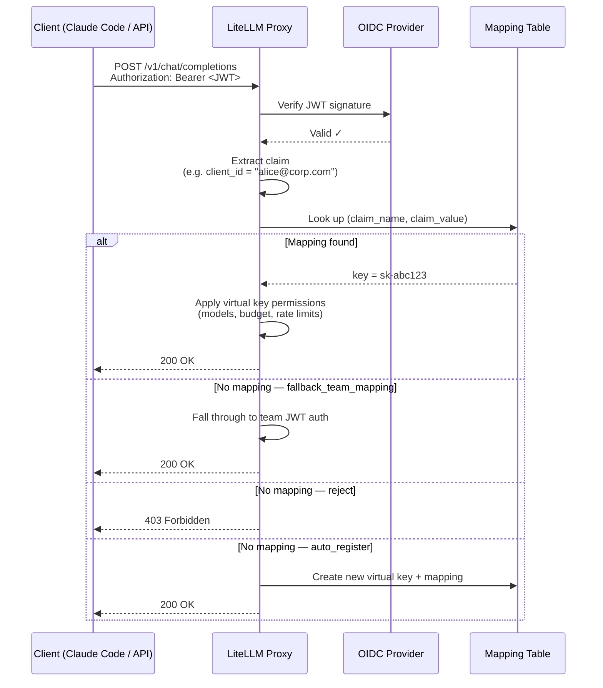

# Source document

This concept mirrors [`docs/proxy/jwt_key_mapping.md`](https://github.com/BerriAI/litellm-docs/blob/main/docs/proxy/jwt_key_mapping.md) from Git revision `038c9caf294fea449d24d6a787f9eaf7e3ca882f`.

The original file is preserved below so the OKF bundle remains a portable, inspectable representation of the repository documentation.

## Original content

````markdown
# JWT → Virtual Key Mapping

:::info Enterprise

JWT → Virtual Key Mapping is an Enterprise feature.

[Get a free trial](https://enterprise.litellm.ai/demo)

:::

Map JWT tokens to LiteLLM virtual keys — so every JWT client gets the same granular controls as a virtual key: model restrictions, spend limits, rate limits, guardrails, and full spend tracking.

**Why this matters:** Standard JWT auth maps a JWT to a *team*. That's a shared boundary — all clients under a team share the same limits. With JWT → Virtual Key Mapping, each individual JWT client (identified by a claim like `client_id`, `azp`, or `sub`) maps to its own virtual key. You get per-client accountability without issuing API keys to your users.

**Common use case:** Your company uses SSO/OIDC. Developers use Claude Code with their identity tokens. You want to enforce per-developer model access and spend limits without giving each person a LiteLLM API key.

---

## How It Works



---

## Setup

### Prerequisites

Complete [OIDC JWT Auth setup](./token_auth.md) first — you need `JWT_PUBLIC_KEY_URL` configured and `enable_jwt_auth: True` in your proxy config.

### Step 1. Configure the JWT claim to map on

Add `virtual_key_claim_field` to your `litellm_jwtauth` config. This is the JWT claim LiteLLM uses as the lookup key:

```yaml
general_settings:
  master_key: sk-1234
  enable_jwt_auth: True
  litellm_jwtauth:
    team_id_jwt_field: "team_id"          # existing team mapping (optional)
    user_id_jwt_field: "sub"
    virtual_key_claim_field: "client_id"  # claim used as the key-mapping lookup
    unregistered_jwt_client_behavior: "fallback_team_mapping"  # see below
```

`virtual_key_claim_field` was previously named `jwt_client_id_field`; the old name still works as a backward-compatible alias.

**`unregistered_jwt_client_behavior`** controls what happens when a JWT has no registered mapping:

| Value | Behavior |
|-------|----------|
| `fallback_team_mapping` | Fall through to team-based JWT auth (default — backward compatible) |
| `reject` | Return 403 if no mapping found |
| `auto_register` | Auto-create a virtual key + mapping on first encounter |

With `auto_register`, the first request carrying a new claim value provisions a virtual key and mapping on the fly, with no admin call. The key is created only after the JWT clears full policy (signature, RBAC/scope, `custom_validate`, and `user_allowed_email_domain`); if the token fails any check the request is rejected and nothing is created. The new key inherits the team, user, and org resolved from the validated JWT, so make sure those claims are configured. A token that resolves to a proxy admin is not auto-registered, since admins already have full access. `auto_register` requires a database connection

### Step 2. Register a JWT client → virtual key mapping

**Recommended: let `auto_register` do it.** Set `unregistered_jwt_client_behavior: "auto_register"` in Step 1 and the first request from each new claim value provisions its own key automatically, with no admin call. Use this when every client should start from the same defaults.

**Manual: register a key with specific limits.** When a client needs its own budget or model set, create the virtual key first, then map a claim value to it. There is no single atomic endpoint; it is two calls.

```bash
# 1. Create a virtual key with the limits you want
curl -X POST 'http://0.0.0.0:4000/key/generate' \
  -H 'Authorization: Bearer <PROXY_MASTER_KEY>' \
  -H 'Content-Type: application/json' \
  -d '{
    "models": ["claude-sonnet-4-5", "claude-haiku-4-5"],
    "max_budget": 50.0,
    "budget_duration": "30d",
    "rpm_limit": 100,
    "tpm_limit": 50000,
    "team_id": "engineering"
  }'
# -> {"key": "sk-abc123...", ...}

# 2. Map a JWT claim value to that key
curl -X POST 'http://0.0.0.0:4000/jwt/key/mapping/new' \
  -H 'Authorization: Bearer <PROXY_MASTER_KEY>' \
  -H 'Content-Type: application/json' \
  -d '{
    "jwt_claim_name": "client_id",
    "jwt_claim_value": "dev-alice",
    "key": "sk-abc123...",
    "description": "dev-alice"
  }'
```

### Step 3. Test it

```bash
# Get a JWT from your OIDC provider (must have client_id: dev-alice)
JWT_TOKEN="eyJhbG..."

curl -X POST 'http://0.0.0.0:4000/v1/chat/completions' \
  -H "Authorization: Bearer $JWT_TOKEN" \
  -H 'Content-Type: application/json' \
  -d '{
    "model": "claude-sonnet-4-5",
    "messages": [{"role": "user", "content": "Hello"}]
  }'
```

The request is now tracked against `dev-alice`'s virtual key — spend, rate limits, and model access enforced per-client.

---

## Walkthrough: Admin grants granular access, team uses Claude Code

This is the full flow for an engineering team using Claude Code with company SSO.

### Admin setup

**1. Create a team for engineering**

```bash
curl -X POST 'http://0.0.0.0:4000/team/new' \
  -H 'Authorization: Bearer <MASTER_KEY>' \
  -H 'Content-Type: application/json' \
  -d '{
    "team_alias": "engineering",
    "models": ["claude-sonnet-4-5", "claude-haiku-4-5"]
  }'
```

**2. Register each developer with their own key and spend limit**

Each developer is a virtual key plus a mapping from their JWT claim to that key. Create the key with `/key/generate`, then map the claim value with `/jwt/key/mapping/new`.

```bash
# Alice: senior eng, higher budget
ALICE_KEY=$(curl -s -X POST 'http://0.0.0.0:4000/key/generate' \
  -H 'Authorization: Bearer <MASTER_KEY>' -H 'Content-Type: application/json' \
  -d '{"team_id": "engineering", "models": ["claude-sonnet-4-5", "claude-haiku-4-5"], "max_budget": 200.0, "budget_duration": "30d", "rpm_limit": 200}' \
  | jq -r '.key')

curl -X POST 'http://0.0.0.0:4000/jwt/key/mapping/new' \
  -H 'Authorization: Bearer <MASTER_KEY>' -H 'Content-Type: application/json' \
  -d "{\"jwt_claim_name\": \"client_id\", \"jwt_claim_value\": \"alice@corp.com\", \"key\": \"$ALICE_KEY\", \"description\": \"alice@corp.com\"}"

# Bob: contractor, tighter limits
BOB_KEY=$(curl -s -X POST 'http://0.0.0.0:4000/key/generate' \
  -H 'Authorization: Bearer <MASTER_KEY>' -H 'Content-Type: application/json' \
  -d '{"team_id": "engineering", "models": ["claude-haiku-4-5"], "max_budget": 20.0, "budget_duration": "30d", "rpm_limit": 30}' \
  | jq -r '.key')

curl -X POST 'http://0.0.0.0:4000/jwt/key/mapping/new' \
  -H 'Authorization: Bearer <MASTER_KEY>' -H 'Content-Type: application/json' \
  -d "{\"jwt_claim_name\": \"client_id\", \"jwt_claim_value\": \"bob@contractor.com\", \"key\": \"$BOB_KEY\", \"description\": \"bob@contractor.com\"}"
```

For teams where everyone starts from the same defaults, skip the per-developer calls and set `unregistered_jwt_client_behavior: "auto_register"` instead.

**3. Configure Claude Code to use the proxy**

Set the proxy as the API base in your team's Claude Code config:

```bash
# Point Claude Code at the LiteLLM proxy instead of Anthropic directly.
# ANTHROPIC_API_KEY here is the bearer token sent to the proxy — set it to
# the user's SSO/OIDC JWT token (obtained from your IdP at login).
export ANTHROPIC_API_KEY="<user-sso-jwt-token>"
export ANTHROPIC_BASE_URL="http://your-litellm-proxy:4000"
```

Or in `~/.claude/settings.json`:

```json
{
  "env": {
    "ANTHROPIC_BASE_URL": "http://your-litellm-proxy:4000"
  }
}
```

**4. Developers authenticate with SSO as usual**

When Alice runs Claude Code, her JWT (issued by your IdP with `client_id: alice@corp.com`) goes to the proxy. LiteLLM looks up the mapping, finds her virtual key, and enforces her specific limits — her $200/month budget, 200 RPM cap, and access to Sonnet and Haiku only.

Bob's token maps to his own key — $20/month, Haiku only, 30 RPM.

No API keys distributed. No shared limits. Full per-developer spend visibility in the LiteLLM dashboard.

---

## Managing mappings

Every mapping has an `id` (returned when you create it). The `info`, `update`, and `delete` endpoints key off that `id`, so start from `list` to find it.

**List mappings**

```bash
curl 'http://0.0.0.0:4000/jwt/key/mapping/list?page=1&size=50' \
  -H 'Authorization: Bearer <MASTER_KEY>'
```

**View one mapping by id**

```bash
curl 'http://0.0.0.0:4000/jwt/key/mapping/info?id=<mapping-id>' \
  -H 'Authorization: Bearer <MASTER_KEY>'
```

The response is the mapping's own metadata: claim name and value, description, `is_active`, timestamps, and who created or last updated it. It does not include the linked key or its settings, and the hashed key is never returned. To inspect the key's models, budget, or spend, use `/key/info`.

**Update a mapping**

`update` changes the mapping itself: point it at a different key, edit the description, or toggle `is_active`. To change budgets or model access, update the underlying key with `/key/update`; the mapping only stores the claim, the linked key, a description, and an active flag.

```bash
curl -X POST 'http://0.0.0.0:4000/jwt/key/mapping/update' \
  -H 'Authorization: Bearer <MASTER_KEY>' \
  -H 'Content-Type: application/json' \
  -d '{
    "id": "<mapping-id>",
    "key": "sk-newkey...",
    "description": "rotated key",
    "is_active": true
  }'
```

**Delete a mapping**

```bash
curl -X POST 'http://0.0.0.0:4000/jwt/key/mapping/delete' \
  -H 'Authorization: Bearer <MASTER_KEY>' \
  -H 'Content-Type: application/json' \
  -d '{"id": "<mapping-id>"}'
```

---

## Security

- Creating, updating, and deleting mappings is restricted to proxy admins; listing and inspecting them also allows the admin viewer role. All `/jwt/key/mapping/*` routes reject other callers with 403.
- The mapping endpoints never return the underlying key or its hashed token; responses carry only the mapping's metadata.
- A mapped or auto-registered key is a standard virtual key. It enforces exactly the models, budgets, rate limits, team, and guardrail settings configured on that key, and like any non-admin key it can call LLM routes but cannot manage other keys or admin resources.

---

## Multiple identity providers

Mappings are keyed on `(jwt_claim_name, jwt_claim_value)` only; there is no per-issuer dimension. If two identity providers can emit the same claim value (for example both send `sub: user-123`), those tokens resolve to the same mapping and collide. Map on a claim that is globally unique across your providers, such as `email`, or configure per-issuer validation with [issuer-bound JWT rules](./token_auth.md) so each provider's identities land on distinct claim values.

---

## What JWT clients can and can't do vs virtual keys

| Capability | Virtual Key | JWT → Key Mapping |
|---|---|---|
| Per-client model access | ✅ | ✅ |
| Per-client spend budget | ✅ | ✅ |
| Per-client RPM/TPM limits | ✅ | ✅ |
| Team membership | ✅ | ✅ |
| Spend tracking in dashboard | ✅ | ✅ |
| Guardrails | ✅ | ✅ |
| Key rotation | ✅ | ✅ (admin only) |
| Key expiry | ✅ | ✅ |
| No API key distribution needed | ❌ | ✅ |
| Works with existing SSO/OIDC | ❌ | ✅ |

---

## Related

- [OIDC JWT Auth](./token_auth.md) — base JWT auth setup required before using this feature
- [Virtual Keys](./virtual_keys.md) — full virtual key documentation
- [Access Control](./access_control.md) — model and team access control
````
