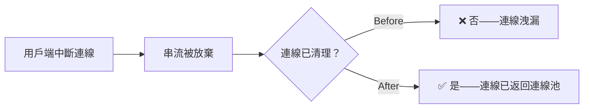
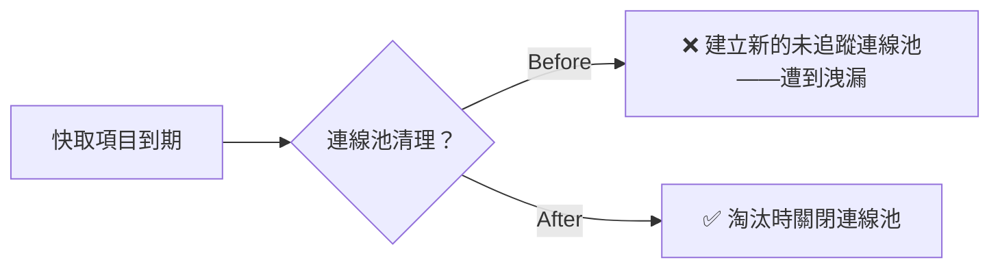

## 部署此版本 {#deploy-this-version}

import Tabs from '@theme/Tabs';
import TabItem from '@theme/TabItem';
import Image from '@theme/IdealImage';

<Tabs>
<TabItem value="docker" label="Docker">

``` showLineNumbers title="docker run litellm"
docker run \
-e STORE_MODEL_IN_DB=True \
-p 4000:4000 \
ghcr.io/berriai/litellm:main-v1.81.14-stable
```

</TabItem>
<TabItem value="pip" label="Pip">

``` showLineNumbers title="pip install litellm"
pip install litellm==1.81.14
```

</TabItem>
</Tabs>

## 重點亮點 {#key-highlights}

- **防護欄花園** — [依使用情境瀏覽內建與合作夥伴防護欄——競品封鎖、主題篩選、GDPR、提示注入等。挑選範本、自訂，並將其附加至團隊或金鑰。](../../docs/proxy/guardrails/policy_templates)
- **合規實作遊樂場** — [在任何防護欄政策上線前，先用自己的流量進行測試。查看精確率、召回率與誤判率——讓您知道它在正式環境中的表現。](../../docs/proxy/guardrails/policy_templates)
- **3 個全新零成本內建防護欄** — [競品名稱封鎖器、主題封鎖器與侮辱過濾器——全部皆為閘道層級、&lt;0.1ms 延遲、無外部 API、可依團隊或金鑰設定](../../docs/proxy/guardrails)
- **透過 UI 將模型儲存在資料庫設定中** - [可直接在 Admin UI 中設定模型儲存，無需編輯設定檔或重新啟動 proxy——非常適合雲端部署](../../docs/proxy/ui_store_model_db_setting)
- **Claude Sonnet 4.6 — 第 0 天** — [Anthropic 與 Vertex AI 全面支援：推理、電腦使用、提示快取、20 萬 context](../../docs/providers/anthropic)
- **20+ 項效能最佳化** — 更快的 routing、更低的記錄負擔、降低的成本計算器延遲，以及連線池修正——讓每個請求的 CPU 與延遲都有實質下降

---

### 防護欄花園 {#guardrail-garden}

AI 平台管理員現在可以從防護欄花園瀏覽內建與合作夥伴防護欄。防護欄依使用情境整理——封鎖財務建議、過濾侮辱、偵測競品提及等——因此您可以快速找到合適項目並在幾次點擊內部署。


### 3 個全新內建防護欄 {#3-new-built-in-guardrails}

此版本帶來 3 個直接在閘道上執行的全新內建防護欄。這對需要低延遲、零成本防護欄的 AI 閘道管理員非常有幫助。

- **拒絕財務建議** — 偵測個人化財務建議、投資建議或財務規劃請求
- **拒絕侮辱** — 偵測針對聊天機器人、員工或其他人的侮辱、叫罵與人身攻擊
- **競品名稱封鎖器** — 偵測回應中提及競品品牌

這些防護欄專為正式環境打造，在我們的基準測試中達到 100% Recall 與 Precision。

### 透過 UI 將模型儲存在資料庫設定中 {#store-model-in-db-settings-via-ui}

過去，`store_model_in_db` 設定只能在 `proxy_config.yaml` 的 `general_settings` 下設定，而且需要重新啟動 proxy 才會生效。現在您可以直接從 Admin UI 啟用或停用此設定，無需任何重新啟動。這對於無法直接存取設定檔，或希望避免停機的雲端部署特別有用。啟用 `store_model_in_db`，即可將模型定義從 YAML 移到資料庫中——降低設定複雜度、提升擴充性，並在多個 proxy 執行個體之間啟用動態模型管理。


#### 評估結果 {#eval-results}

我們在發布前，先使用標記資料集對新的內建防護欄進行基準測試。您可以看到 Denied Financial Advice（207 個案例）與 Denied Insults（299 個案例）的結果：

| 防護欄 | Precision | Recall | F1 | p50 延遲 | 每次請求成本 |
|-----------|-----------|--------|----|-------------|----------|
| Denied Financial Advice | 100% | 100% | 100% | &lt;0.1ms | $0 |
| Denied Insults | 100% | 100% | 100% | &lt;0.1ms | $0 |

100% precision 代表零誤判——沒有合法訊息被錯誤封鎖。100% recall 代表零漏判——每一則應該被封鎖的訊息都被攔截。

### 合規實作遊樂場 {#compliance-playground}

合規實作遊樂場可讓您使用我們預先建立的評估資料集或您自己的自訂資料集來測試任何防護欄，讓您在正式環境上線前先查看 precision、recall 與誤判率。


---

## 效能與可靠性——延遲最高降低 13% {#performance--reliability--up-to-13-lower-latency}

<Image img={require('../../img/release_notes/v1_81_14_perf.png')} />

此版本透過在記錄、成本計算、routing 與連線管理上的 20+ 項微最佳化，降低所有百分位的延遲。更多關於如何自行基準測試的資訊，請參閱 [基準測試](../../docs/benchmarks)。 

- **平均延遲：** 78.4 ms → **70.3 ms**（−10.3%）
- **p50 延遲：** 64.8 ms → **57.3 ms**（−11.7%）
- **p99 延遲：** 288.9 ms → **250.0 ms**（−13.4%）

**串流連線池修正**

修正了一個 3 倍的連線洩漏問題，該問題在串流工作負載下導致 TCP 連線耗盡：aiohttp transport 沒有關閉連線、沒有 `finally` 區塊在中斷連線時呼叫 close，且 Uvicorn 的 bug 阻止了中斷連線訊號傳遞。[PR #21213](https://github.com/BerriAI/litellm/pull/21213)



**Redis 連線池可靠性**

修正了 4 個彼此獨立的連線池 bug，使我們使用 Redis 的方式更可靠。最重要的變更是修正快取過期時連線池遭到洩漏，其餘修正詳見 [PR #21717](https://github.com/BerriAI/litellm/pull/21717)。



---

## 新增提供者與端點 {#new-providers-and-endpoints}

### 新增提供者（1 個新提供者） {#new-providers-1-new-provider}

| 提供者 | 支援的 LiteLLM 端點 | 描述 |
| -------- | --------------------------- | ----------- |
| [IBM watsonx.ai](../../docs/providers/watsonx) | `/rerank` | 支援 IBM watsonx.ai 模型的 rerank |

### 新增 LLM API 端點（1 個新端點） {#new-llm-api-endpoints-1-new-endpoint}

| 端點 | 方法 | 描述 | 文件 |
| -------- | ------ | ----------- | ------------- |
| `/v1/evals` | POST/GET | 用於模型評估的 OpenAI 相容 Evals API | [文件](../../docs/evals_api) |

---

## 新模型 / 已更新模型 {#new-models--updated-models}

#### 新增模型支援（13 個新模型） {#new-model-support-13-new-models}

| 提供者 | 模型 | context 視窗 | 輸入（$/100 萬 tokens） | 輸出（$/100 萬 tokens） | 功能 |
| -------- | ----- | -------------- | ------------------- | -------------------- | -------- |
| Anthropic | `claude-sonnet-4-6` | 200K | $3.00 | $15.00 | 推理、電腦使用、提示快取、vision、PDF |
| Vertex AI | `vertex_ai/claude-opus-4-6@default` | 1M | $5.00 | $25.00 | 推理、電腦使用、提示快取 |
| Google Gemini | `gemini/gemini-3.1-pro-preview` | 1M | $2.00 | $12.00 | 音訊、影片、圖片、PDF |
| Google Gemini | `gemini/gemini-3.1-pro-preview-customtools` | 1M | $2.00 | $12.00 | 自訂工具 |
| GitHub Copilot | `github_copilot/gpt-5.3-codex` | 128K | - | - | Responses API、function calling、vision |
| GitHub Copilot | `github_copilot/claude-opus-4.6-fast` | 128K | - | - | Chat completions、function calling、vision |
| Mistral | `mistral/devstral-small-latest` | 256K | $0.10 | $0.30 | function calling、response schema |
| Mistral | `mistral/devstral-latest` | 256K | $0.40 | $2.00 | function calling、response schema |
| Mistral | `mistral/devstral-medium-latest` | 256K | $0.40 | $2.00 | function calling、response schema |
| OpenRouter | `openrouter/minimax/minimax-m2.5` | 196K | $0.30 | $1.10 | function calling、推理、提示快取 |
| Fireworks AI | `fireworks_ai/accounts/fireworks/models/glm-4p7` | - | - | - | 聊天補全 |
| Fireworks AI | `fireworks_ai/accounts/fireworks/models/minimax-m2p1` | - | - | - | 聊天補全 |
| Fireworks AI | `fireworks_ai/accounts/fireworks/models/kimi-k2p5` | - | - | - | 聊天補全 |

#### 功能 {#features}

- **[Anthropic](../../docs/providers/anthropic)**
    - Claude Sonnet 4.6 的第 0 天支援，包含 reasoning、computer use 與 200K context - [PR #21401](https://github.com/BerriAI/litellm/pull/21401)
    - 新增 Claude Sonnet 4.6 定價 - [PR #21395](https://github.com/BerriAI/litellm/pull/21395)
    - 新增 Claude Sonnet 4.6 的第 0 天功能支援（streaming、function calling、vision）- [PR #21448](https://github.com/BerriAI/litellm/pull/21448)
    - 為 Sonnet 4.6 新增 `reasoning` effort 與 extended thinking 支援 - [PR #21598](https://github.com/BerriAI/litellm/pull/21598)
    - 修正 `translate_system_message` 中的空白系統訊息 - [PR #21630](https://github.com/BerriAI/litellm/pull/21630)
    - 為多輪相容性清理 Anthropic 訊息 - [PR #21464](https://github.com/BerriAI/litellm/pull/21464)
    - 將 `websearch` tool 從 `/v1/messages` 對應至 `/chat/completions` - [PR #21465](https://github.com/BerriAI/litellm/pull/21465)
    - 在 delta streaming 中將 `reasoning` 欄位轉送為 `reasoning_content` - [PR #21468](https://github.com/BerriAI/litellm/pull/21468)
    - 新增從 OpenAI 格式轉換為 Anthropic 格式的伺服器端 compaction 轉換 - [PR #21555](https://github.com/BerriAI/litellm/pull/21555)

- **[AWS Bedrock](../../docs/providers/bedrock)**
    - 原生 structured outputs API 支援（`outputConfig.textFormat`）- [PR #21222](https://github.com/BerriAI/litellm/pull/21222)
    - 為自訂匯入模型支援 `nova/` 與 `nova-2/` 規格前綴 - [PR #21359](https://github.com/BerriAI/litellm/pull/21359)
    - 擴大 Nova 2 模型偵測，以支援所有 `nova-2-*` 變體 - [PR #21358](https://github.com/BerriAI/litellm/pull/21358)
    - 將 `thinking.budget_tokens` 下限限制為 1024 - [PR #21306](https://github.com/BerriAI/litellm/pull/21306)
    - 修正 Bedrock Converse 的 `parallel_tool_calls` 對應 - [PR #21659](https://github.com/BerriAI/litellm/pull/21659)

- **[Google Gemini / Vertex AI](../../docs/providers/gemini)**
    - `gemini-3.1-pro-preview` 的第 0 天支援 - [PR #21568](https://github.com/BerriAI/litellm/pull/21568)
    - 修正所有 Gemini 3 系列模型的 `_map_reasoning_effort_to_thinking_level` - [PR #21654](https://github.com/BerriAI/litellm/pull/21654)
    - 透過設定為 Gemini 模型新增 reasoning 支援 - [PR #21663](https://github.com/BerriAI/litellm/pull/21663)

- **[Databricks](../../docs/providers/databricks)**
    - 將 Databricks 新增至 response schema 的支援提供者 - [PR #21368](https://github.com/BerriAI/litellm/pull/21368)
    - 為 Databricks GPT 模型提供原生 Responses API 支援 - [PR #21460](https://github.com/BerriAI/litellm/pull/21460)

- **[GitHub Copilot](../../docs/providers/github_copilot)**
    - 新增 `github_copilot/gpt-5.3-codex` 與 `github_copilot/claude-opus-4.6-fast` 模型 - [PR #21316](https://github.com/BerriAI/litellm/pull/21316)
    - 修正 ChatGPT Codex 不支援的參數 - [PR #21209](https://github.com/BerriAI/litellm/pull/21209)
    - 允許 GitHub 模型別名重用上游模型中繼資料 - [PR #21497](https://github.com/BerriAI/litellm/pull/21497)

- **[Mistral](../../docs/providers/mistral)**
    - 新增 `devstral-2512` 模型別名（`devstral-small-latest`、`devstral-latest`、`devstral-medium-latest`）- [PR #21372](https://github.com/BerriAI/litellm/pull/21372)

- **[IBM watsonx.ai](../../docs/providers/watsonx)**
    - 新增原生 rerank 支援 - [PR #21303](https://github.com/BerriAI/litellm/pull/21303)

- **[xAI](../../docs/providers/xai)**
    - 修正 xAI 回應中的 usage 物件 - [PR #21559](https://github.com/BerriAI/litellm/pull/21559)

- **[Dashscope](../../docs/providers/dashscope)**
    - 移除導致請求格式錯誤的 list-to-str 轉換 - [PR #21547](https://github.com/BerriAI/litellm/pull/21547)

- **[hosted_vllm](../../docs/providers/vllm)**
    - 將 thinking blocks 轉換為 content blocks 以支援多輪對話 - [PR #21557](https://github.com/BerriAI/litellm/pull/21557)

- **[OCI / Oracle](../../docs/providers/oci_cohere)**
    - 修正 Grok 輸出定價 - [PR #21329](https://github.com/BerriAI/litellm/pull/21329)

- **[AU Anthropic](../../docs/providers/anthropic)**
    - 修正 `au.anthropic.claude-opus-4-6-v1` 模型 ID - [PR #20731](https://github.com/BerriAI/litellm/pull/20731)

- **一般**
    - 新增基於 reasoning 支援的路由——當存在 `thinking` 參數時，略過不支援 reasoning 的部署 - [PR #21302](https://github.com/BerriAI/litellm/pull/21302)
    - 為 OpenAI 與 Azure 新增 `stop` 作為支援的參數 - [PR #21539](https://github.com/BerriAI/litellm/pull/21539)
    - 將 `store` 與其他缺少的參數新增至 `OPENAI_CHAT_COMPLETION_PARAMS` - [PR #21195](https://github.com/BerriAI/litellm/pull/21195), [PR #21360](https://github.com/BerriAI/litellm/pull/21360)
    - 保留來自 proxy 回應的 `provider_specific_fields` - [PR #21220](https://github.com/BerriAI/litellm/pull/21220)
    - 新增預設 usage 資料設定 - [PR #21550](https://github.com/BerriAI/litellm/pull/21550)

### 錯誤修正 {#bug-fixes}

- **[AWS Bedrock](../../docs/providers/bedrock)**
    - 修正 service_tier 成本傳遞 - [PR #21172](https://github.com/BerriAI/litellm/pull/21172)
    - 修正多模態 embeddings 的每張圖片定價 - [PR #21646](https://github.com/BerriAI/litellm/pull/21646)
    - 在 `encode_file_id_with_model` 中為 Vertex AI batch IDs 使用 `batch_` 前綴 - [PR #21624](https://github.com/BerriAI/litellm/pull/21624)

- **[Bedrock Converse](../../docs/providers/bedrock)**
    - 修正 Anthropic usage 物件以符合 v1/messages 規格 - [PR #21295](https://github.com/BerriAI/litellm/pull/21295)

- **[Fireworks AI](../../docs/providers/fireworks_ai)**
    - 新增 `glm-4p7`、`minimax-m2p1`、`kimi-k2p5` 的缺少模型定價 - [PR #21642](https://github.com/BerriAI/litellm/pull/21642)

- **[Responses API](../../docs/response_api)**
    - 修正 reasoning 參數使用 `use None` 而非 `Reasoning()` - [PR #21103](https://github.com/BerriAI/litellm/pull/21103)
    - 保留 codex/responses 路徑中自訂回呼的中繼資料 - [PR #21243](https://github.com/BerriAI/litellm/pull/21243)

---

## LLM API 端點 {#llm-api-endpoints}

#### 功能 {#features-1}

- **[Responses API](../../docs/response_api)**
    - 當回應包含 function_call 項目時回傳 `finish_reason='tool_calls'` - [PR #19745](https://github.com/BerriAI/litellm/pull/19745)
    - 移除 async streaming 路徑中每個 chunk 都建立執行緒的做法，以大幅提升吞吐量 - [PR #21709](https://github.com/BerriAI/litellm/pull/21709)

- **[Evals API](../../docs/evals_api)**
    - 新增 OpenAI Evals API 支援 - [PR #21375](https://github.com/BerriAI/litellm/pull/21375)

- **[Batch API](../../docs/batches)**
    - 新增具備 batch references 的檔案刪除條件 - [PR #21456](https://github.com/BerriAI/litellm/pull/21456)
    - managed batches 的其他錯誤修正 - [PR #21157](https://github.com/BerriAI/litellm/pull/21157)

- **[轉送端點](../../docs/pass_through/bedrock)**
    - 為 passthrough 端點新增基於方法的路由 - [PR #21543](https://github.com/BerriAI/litellm/pull/21543)
    - 透過 proxy 層保留並轉送 OAuth Authorization 標頭 - [PR #19912](https://github.com/BerriAI/litellm/pull/19912)

- **[網頁搜尋 / 工具呼叫](../../docs/completion/input)**
    - 新增 DuckDuckGo 作為搜尋工具 - [PR #21467](https://github.com/BerriAI/litellm/pull/21467)
    - 修正 websearch 未透過 proxy router 觸發的 `pre_call_deployment_hook` - [PR #21433](https://github.com/BerriAI/litellm/pull/21433)

- **一般**
    - 排除不支援 function calling 的模型之 tool 參數 - [PR #21244](https://github.com/BerriAI/litellm/pull/21244)
    - 為 OpenAI chat completion 參數新增 `store` 參數 - [PR #21195](https://github.com/BerriAI/litellm/pull/21195)
    - 為每個模型的 reasoning 設定透過 config 新增 reasoning 支援 - [PR #21663](https://github.com/BerriAI/litellm/pull/21663)

#### 錯誤 {#bugs}

- **一般**
    - 修正具有多個潛在端點之模型的 `api_base` 解析錯誤 - [PR #21658](https://github.com/BerriAI/litellm/pull/21658)
    - 修正來自 `query_raw` 的 dict rows 造成 session grouping 中斷 - [PR #21435](https://github.com/BerriAI/litellm/pull/21435)

---

## 管理端點 / UI {#management-endpoints--ui}

#### 功能 {#features-2}

- **存取群組**
    - 在 Keys/Teams 的建立與編輯流程中新增 Access Group Selector - [PR #21234](https://github.com/BerriAI/litellm/pull/21234)

- **虛擬金鑰**
    - 修正來自 env/UI 的 virtual key 寬限期 - [PR #20321](https://github.com/BerriAI/litellm/pull/20321)
    - 修正 key 到期預設期間 - [PR #21362](https://github.com/BerriAI/litellm/pull/21362)
    - Key Last Active Tracking — 查看 key 上次使用時間 - [PR #21545](https://github.com/BerriAI/litellm/pull/21545)
    - 修正 `/v1/models` 在 BYOK team keys 中回傳萬用字元而非展開後的 models - [PR #21408](https://github.com/BerriAI/litellm/pull/21408)
    - 在 delete_verification_tokens 回應中回傳 `failed_tokens` - [PR #21609](https://github.com/BerriAI/litellm/pull/21609)

- **模型 + 端點**
    - 在 Models & Endpoints 頁面新增 Model Settings Modal - [PR #21516](https://github.com/BerriAI/litellm/pull/21516)
    - 允許透過資料庫設定 `store_model_in_db`（不只透過 config）- [PR #21511](https://github.com/BerriAI/litellm/pull/21511)
    - 修正 Model Info UI 中被遮罩/隱藏的 `input_cost_per_token` - [PR #21723](https://github.com/BerriAI/litellm/pull/21723)
    - 修正在批次檔案上傳時 UI 建立的模型憑證 - [PR #21502](https://github.com/BerriAI/litellm/pull/21502)
    - 解析 UI 建立的模型憑證 - [PR #21502](https://github.com/BerriAI/litellm/pull/21502)

- **團隊**
    - 允許團隊成員檢視整個團隊的用量 - [PR #21537](https://github.com/BerriAI/litellm/pull/21537)
    - 修正團隊成員的 service account 可見性 - [PR #21627](https://github.com/BerriAI/litellm/pull/21627)
    - Organization Info 頁面：顯示成員電子郵件、AntD 分頁標籤、可重用的 MemberTable - [PR #21745](https://github.com/BerriAI/litellm/pull/21745)

- **用量 / 支出記錄**
    - 允許依使用者篩選用量 - [PR #21351](https://github.com/BerriAI/litellm/pull/21351)
    - 將 Credential Name 注入為用量頁面篩選的標籤 - [PR #21715](https://github.com/BerriAI/litellm/pull/21715)
    - 在標籤前加上 credential 前綴，並更新標籤用量橫幅 - [PR #21739](https://github.com/BerriAI/litellm/pull/21739)
    - 在 Logs 檢視中顯示請求的重試次數 - [PR #21704](https://github.com/BerriAI/litellm/pull/21704)
    - 修正 Aggregated Daily Activity Endpoint 效能 - [PR #21613](https://github.com/BerriAI/litellm/pull/21613)

- **SSO / 驗證**
    - 修正多個 pod 的 Kubernetes 部署中的 SSO PKCE 支援 - [PR #20314](https://github.com/BerriAI/litellm/pull/20314)
    - 不論 `role_mappings` config 為何，都保留 SSO role - [PR #21503](https://github.com/BerriAI/litellm/pull/21503)

- **Proxy CLI / Master Key**
    - 修正 master key rotation 的 Prisma 驗證錯誤 - [PR #21330](https://github.com/BerriAI/litellm/pull/21330)
    - 處理 `append_query_params` 中缺少的 `DATABASE_URL` - [PR #21239](https://github.com/BerriAI/litellm/pull/21239)

- **專案管理**
    - 新增用於組織資源的 Project Management APIs - [PR #21078](https://github.com/BerriAI/litellm/pull/21078)

- **UI 改善**
    - Content Filters：協助編輯/檢視分類，並可在分頁下 1 次點擊新增 - [PR #21223](https://github.com/BerriAI/litellm/pull/21223)
    - Playground：使用 UI 測試備援 - [PR #21007](https://github.com/BerriAI/litellm/pull/21007)
    - 在一般設定中新增 `forward_client_headers_to_llm_api` 切換 - [PR #21776](https://github.com/BerriAI/litellm/pull/21776)
    - 修正每個請求都會產生的 `is_premium()` debug log 噪音 - [PR #20841](https://github.com/BerriAI/litellm/pull/20841)

#### 錯誤 {#bugs-1}

- 支出記錄：修正成本計算 - [PR #21152](https://github.com/BerriAI/litellm/pull/21152)
- Logs：修正表格未更新與分頁問題 - [PR #21708](https://github.com/BerriAI/litellm/pull/21708)
- 修正當 `cached_logo.jpg` 存在時，`/get_image` 忽略 `UI_LOGO_PATH` - [PR #21637](https://github.com/BerriAI/litellm/pull/21637)
- 修正 `tagsSpendLogsCall` query string 中重複的 URL - [PR #20909](https://github.com/BerriAI/litellm/pull/20909)
- 在刪除或重新產生金鑰後，保留 `/user/daily/activity/aggregated` 中的 `key_alias` 和 `team_id` metadata - [PR #20684](https://github.com/BerriAI/litellm/pull/20684)
- 取消註解 `user_info` 端點中的 `response_model` - [PR #17430](https://github.com/BerriAI/litellm/pull/17430)
- 允許 `internal_user_viewer` 存取 RAG 端點；將 ingest 限制為現有的 vector stores - [PR #21508](https://github.com/BerriAI/litellm/pull/21508)
- 在 agent permission handler 中抑制 `litellm-dashboard` team 的警告 - [PR #21721](https://github.com/BerriAI/litellm/pull/21721)

---

## AI 整合 {#ai-integrations}

### 記錄 {#logging}

- **[DataDog](../../docs/proxy/logging#datadog)**
    - 在 logs、metrics 和 cost management 中新增 `team` 標籤 - [PR #21449](https://github.com/BerriAI/litellm/pull/21449)

- **[Prometheus](../../docs/proxy/logging#prometheus)**
    - 修正 `litellm_proxy_total_requests_metric` 的重複計數 - [PR #21159](https://github.com/BerriAI/litellm/pull/21159)
    - 在 Prometheus metrics 中防範 None metadata - [PR #21489](https://github.com/BerriAI/litellm/pull/21489)
    - 新增 ASGI middleware 以改善 Prometheus metrics 收集 - [PR #20434](https://github.com/BerriAI/litellm/pull/20434)

- **[Langfuse](../../docs/proxy/logging#langfuse)**
    - 改善 Langfuse 測試隔離（多項穩定性修正）- [PR #21214](https://github.com/BerriAI/litellm/pull/21214)

- **一般**
    - 在記錄中將快取回應的成本修正為 0 - [PR #21816](https://github.com/BerriAI/litellm/pull/21816)
    - 透過修正 middleware 和 logging 瓶頸來提升串流 proxy 吞吐量 - [PR #21501](https://github.com/BerriAI/litellm/pull/21501)
    - 降低大型 base64 payload 的 proxy 額外負擔 - [PR #21594](https://github.com/BerriAI/litellm/pull/21594)
    - 關閉串流連線以避免 connection pool 耗盡 - [PR #21213](https://github.com/BerriAI/litellm/pull/21213)

### 防護欄 {#guardrails}

- **防護欄園地**
    - 推出 Guardrail Garden — 一個可一鍵部署預建防護欄的市集 - [PR #21732](https://github.com/BerriAI/litellm/pull/21732)
    - 以垂直 stepper UI 重新設計防護欄建立表單 - [PR #21727](https://github.com/BerriAI/litellm/pull/21727)
    - 在記錄詳細檢視中新增防護欄跳轉連結 - [PR #21437](https://github.com/BerriAI/litellm/pull/21437)
    - 防護欄追蹤 UI：顯示 policy、偵測方法與符合詳情 - [PR #21349](https://github.com/BerriAI/litellm/pull/21349)

- **AI 政策範本**
    - 此版本隨附七個全新的可直接部署政策範本：
        - GDPR 第 32 條 EU PII 保護 - [PR #21340](https://github.com/BerriAI/litellm/pull/21340)
        - EU AI Act Article 5（5 個子防護欄，支援法文）- [PR #21342](https://github.com/BerriAI/litellm/pull/21342), [PR #21453](https://github.com/BerriAI/litellm/pull/21453), [PR #21427](https://github.com/BerriAI/litellm/pull/21427)
        - Prompt injection 偵測 - [PR #21520](https://github.com/BerriAI/litellm/pull/21520)
        - 具備基於標籤路由的 aviation 和 UAE 主題篩選 - [PR #21518](https://github.com/BerriAI/litellm/pull/21518)
        - 航空公司非相關主題限制 - [PR #21607](https://github.com/BerriAI/litellm/pull/21607)
        - SQL 注入 - [PR #21806](https://github.com/BerriAI/litellm/pull/21806)
    - 具備延遲額外負擔估計的 AI 驅動政策範本建議 - [PR #21589](https://github.com/BerriAI/litellm/pull/21589), [PR #21608](https://github.com/BerriAI/litellm/pull/21608), [PR #21620](https://github.com/BerriAI/litellm/pull/21620)

- **合規檢查器**
    - 新增合規檢查器端點 + UI 面板 - [PR #21432](https://github.com/BerriAI/litellm/pull/21432)
    - 將 CSV 資料集上傳至合規 playground 以進行批次測試 - [PR #21526](https://github.com/BerriAI/litellm/pull/21526)

- **內建防護欄**
    - 競爭對手名稱封鎖器：依名稱封鎖、處理串流、支援名稱變體，並拆分 pre/post call - [PR #21719](https://github.com/BerriAI/litellm/pull/21719), [PR #21533](https://github.com/BerriAI/litellm/pull/21533)
    - 具備 keyword 與 embedding 兩種實作的主題封鎖器 - [PR #21713](https://github.com/BerriAI/litellm/pull/21713)
    - 侮辱性內容篩選器 - [PR #21729](https://github.com/BerriAI/litellm/pull/21729)
    - 用於封鎖未註冊 MCP servers 的 MCP Security 防護欄 - [PR #21429](https://github.com/BerriAI/litellm/pull/21429)

- **[Generic Guardrails](../../docs/proxy/guardrails)**
    - 新增可設定的 fallback，以處理 generic guardrail 端點連線失敗 - [PR #21245](https://github.com/BerriAI/litellm/pull/21245)

- **[Presidio](../../docs/proxy/guardrails)**
    - 修正 Presidio controls 設定 - [PR #21798](https://github.com/BerriAI/litellm/pull/21798)

- **[LakeraAI](../../docs/proxy/guardrails)**
    - 在初始化期間缺少 `LAKERA_API_KEY` 時避免 `KeyError` - [PR #21422](https://github.com/BerriAI/litellm/pull/21422)

### 自動路由 {#auto-routing}

- **基於複雜度的自動路由** — 新的 router 策略，會從 7 個維度（token 數量、是否包含程式碼、推理標記、技術詞彙等）為請求評分，並路由到適當的模型層級 — 不需要 embeddings 或 API 呼叫 - [PR #21789](https://github.com/BerriAI/litellm/pull/21789), [Docs](../../docs/proxy/auto_routing)

### Prompt 管理 {#prompt-management}

- **提示管理 API**
    - 可在不需要 PR 的情況下與 prompt management 整合互動的新 API - [PR #17800](https://github.com/BerriAI/litellm/pull/17800), [PR #17946](https://github.com/BerriAI/litellm/pull/17946)
    - 修正 prompt registry 設定問題 - [PR #21402](https://github.com/BerriAI/litellm/pull/21402)

---

## 用量追蹤、預算與速率限制 {#spend-tracking-budgets-and-rate-limiting}

- **修正 Bedrock service_tier 成本傳遞** — 來自 service-tier 回應的成本現在會正確流入支出追蹤 - [PR #21172](https://github.com/BerriAI/litellm/pull/21172)
- **修正快取回應的成本** — 快取回應現在會正確記錄 $0 成本，而不是重新計費 - [PR #21816](https://github.com/BerriAI/litellm/pull/21816)
- **彙總每日活動端點效能** — 為 `/user/daily/activity/aggregated` 提供更快的查詢 - [PR #21613](https://github.com/BerriAI/litellm/pull/21613)
- **在 `/user/daily/activity/aggregated` 中保留 key_alias 和 team_id 中繼資料**，於金鑰刪除或重新產生後 - [PR #20684](https://github.com/BerriAI/litellm/pull/20684)
- **將 Credential Name 注入為標籤**，以便依據憑證進行更精細的用量頁面篩選 - [PR #21715](https://github.com/BerriAI/litellm/pull/21715)

---

## MCP 閘道 {#mcp-gateway}

- **OpenAPI-to-MCP** — 透過 API 或 UI 將任何 OpenAPI 規格轉換為 MCP 伺服器 - [PR #21575](https://github.com/BerriAI/litellm/pull/21575), [PR #21662](https://github.com/BerriAI/litellm/pull/21662)
- **MCP 使用者權限** — 針對 MCP 伺服器的終端使用者提供細粒度權限 - [PR #21462](https://github.com/BerriAI/litellm/pull/21462)
- **MCP 安全防護欄** — 阻擋對未註冊 MCP 伺服器的呼叫 - [PR #21429](https://github.com/BerriAI/litellm/pull/21429)
- **修正 StreamableHTTPSessionManager** — 回復為無狀態模式以避免工作階段狀態問題 - [PR #21323](https://github.com/BerriAI/litellm/pull/21323)
- **修正 Bedrock AgentCore Accept 標頭** — 為 AgentCore MCP 伺服器請求新增必要的 Accept 標頭 - [PR #21551](https://github.com/BerriAI/litellm/pull/21551)

---

## 效能 / 負載平衡 / 可靠性改善 {#performance--loadbalancing--reliability-improvements}

**記錄與回呼額外負擔**

- 將 async/sync 回呼分離從每次請求移到回呼註冊時機 — 對回呼密集型部署帶來約 30% 的速度提升 - [PR #20354](https://github.com/BerriAI/litellm/pull/20354)
- 在記錄負載中略過 Pydantic Usage 來回轉換 — 降低每次請求的序列化額外負擔 - [PR #21003](https://github.com/BerriAI/litellm/pull/21003)
- 對非串流請求略過重複的 `get_standard_logging_object_payload` 呼叫 - [PR #20440](https://github.com/BerriAI/litellm/pull/20440)
- 在整個請求生命週期中重用 `LiteLLM_Params` 物件 - [PR #20593](https://github.com/BerriAI/litellm/pull/20593)
- 最佳化 `add_litellm_data_to_request` 熱路徑 - [PR #20526](https://github.com/BerriAI/litellm/pull/20526)
- 最佳化 `model_dump_with_preserved_fields` - [PR #20882](https://github.com/BerriAI/litellm/pull/20882)
- 在模組載入時預先計算 OpenAI client 初始化參數，而不是每次請求都計算 - [PR #20789](https://github.com/BerriAI/litellm/pull/20789)
- 減少大型 base64 負載的代理額外負擔 - [PR #21594](https://github.com/BerriAI/litellm/pull/21594)
- 透過修正 middleware 和記錄瓶頸，提升串流代理吞吐量 - [PR #21501](https://github.com/BerriAI/litellm/pull/21501)
- 移除 Responses API 非同步串流中的每個 chunk 都建立執行緒 - [PR #21709](https://github.com/BerriAI/litellm/pull/21709)

**成本計算**

- 透過早期退出與快取最佳化 `completion_cost()` - [PR #20448](https://github.com/BerriAI/litellm/pull/20448)
- 成本計算器：減少重複查找與 dict 複製 - [PR #20541](https://github.com/BerriAI/litellm/pull/20541)

**路由與負載平衡**

- 移除 usage-based routing v2 中二次方級的部署掃描 - [PR #21211](https://github.com/BerriAI/litellm/pull/21211)
- 避免團隊部署篩選中的 O(n²) 成員資格掃描 - [PR #21210](https://github.com/BerriAI/litellm/pull/21210)
- 對非 alias 的 `get_model_list` 查找避免 O(n) alias 掃描 - [PR #21136](https://github.com/BerriAI/litellm/pull/21136)
- 提高預設 LRU 快取大小以減少多模型快取抖動 - [PR #21139](https://github.com/BerriAI/litellm/pull/21139)
- 在 Router 上快取 `get_model_access_groups()` 無參數結果 - [PR #20374](https://github.com/BerriAI/litellm/pull/20374)
- 部署親和性路由回呼 — 為同一個工作階段路由到相同部署 - [PR #19143](https://github.com/BerriAI/litellm/pull/19143)
- 以 Session-ID 為基礎的路由 — 在工作階段內使用 `session_id` 以維持一致的路由 - [PR #21763](https://github.com/BerriAI/litellm/pull/21763)

**連線管理與可靠性**

- 修正 Redis 連線池可靠性 — 防止在高負載下連線耗盡 - [PR #21717](https://github.com/BerriAI/litellm/pull/21717)
- 修正 Prisma 連線自我修復，用於驗證與執行階段重新連線（已回復，將連同修正重新導入） - [PR #21706](https://github.com/BerriAI/litellm/pull/21706)
- 關閉串流連線以防止連線池耗盡 - [PR #21213](https://github.com/BerriAI/litellm/pull/21213)
- 將 `PodLockManager.release_lock` 改為原子性的 compare-and-delete - [PR #21226](https://github.com/BerriAI/litellm/pull/21226)

---

## 資料庫變更 {#database-changes}

### 結構描述更新 {#schema-updates}

| 資料表 | 變更類型 | 說明 | PR |
| ----- | ----------- | ----------- | -- |
| `LiteLLM_DeletedVerificationToken` | 新增欄位 | 新增 `project_id` 欄位 | [PR #21587](https://github.com/BerriAI/litellm/pull/21587) |
| `LiteLLM_ProjectTable` | 新資料表 | 用於組織資源的專案管理 | [PR #21078](https://github.com/BerriAI/litellm/pull/21078) |
| `LiteLLM_VerificationToken` | 新增欄位 | 新增 `last_active` 時間戳記以追蹤金鑰活動 | [PR #21545](https://github.com/BerriAI/litellm/pull/21545) |
| `LiteLLM_ManagedVectorStoreTable` | 遷移 | 使 vector store 遷移具備冪等性 | [PR #21325](https://github.com/BerriAI/litellm/pull/21325) |

---

## 安全性 {#security}

我們在每個 LiteLLM Docker 映像上執行 [Grype](https://github.com/anchore/grype) 和 [Trivy](https://github.com/aquasecurity/trivy) 安全掃描。以下是此版本於所有已發布映像中的弱點報告：

### Docker 映像掃描摘要 {#docker-image-scan-summary}

| 映像 | Critical | High | Medium | Low |
|-------|----------|------|--------|-----|
| `ghcr.io/berriai/litellm:main-latest` | **0** ✅ | 4 個獨特 CVE | 4 | 1 |
| `ghcr.io/berriai/litellm-ee:main-latest` | **0** ✅ | 4 個獨特 CVE | 4 | 1 |
| `ghcr.io/berriai/litellm-non_root:main-latest` | **1** | 11 個獨特 CVE | 6 | 2 |
| `ghcr.io/berriai/litellm-database:main-latest` | **1** | 7 個獨特 CVE | 5 | 1 |
| `ghcr.io/berriai/litellm-spend_logs:main-latest` | **4** | 35 個比對項目 | 40 | 10 |

:::note
弱點數量是根據包含建置時工具的完整映像掃描得出。High 的比對數常會因像 `minimatch` 這類套件出現在多個版本而被放大；上方的獨特 CVE 數量反映的是實際不同的弱點。
:::

### Critical 嚴重性 {#critical-severity}

**1. Node.js Critical（non-root、database、spend_logs 映像）：**
Node.js 24.12.0 **僅**用於 Admin UI 建置與 Prisma client 產生 — 它**不**屬於 LiteLLM Python 應用程式執行階段的一部分。

| 套件 | 弱點 | 說明 | 修正版本 |
|---------|---------------|-------------|-------------|
| `node` | CVE-2025-55130 | Node.js critical vulnerability | 20.20.0 |

**2. OpenSSL 與 Go Critical（僅 spend_logs 映像）：**
`spend_logs` 映像在底層 Go 模組與系統函式庫中包含額外弱點。

| 套件 | 弱點 | 說明 | 修正版本 |
|---------|---------------|-------------|-------------|
| `libcrypto3`, `libssl3` | CVE-2025-15467 | OpenSSL critical vulnerability | 3.3.6-r0 |
| `stdlib` (Go) | CVE-2025-68121 | Go 標準函式庫 critical vulnerability | 1.24.13+ |

### High 嚴重性 {#high-severity}

所有 high 嚴重性弱點都位於 **npm/Node.js 建置時相依性** 或系統層級函式庫中 — 它們**不**在 LiteLLM Python 應用程式程式碼中。

**存在於所有映像中：**

| 套件 | 弱點 | 說明 | 修正版本 |
|---------|---------------|-------------|-------------|
| `minimatch` | CVE-2026-26996 | 透過特製的 glob patterns 造成 DoS | 10.2.1+ / 9.0.6+ |
| `minimatch` | CVE-2026-27903 | 因無界限遞迴回溯造成 DoS | 10.2.3+ / 9.0.7+ |
| `minimatch` | CVE-2026-27904 | 透過 glob expressions 中的災難性回溯造成 DoS | 10.2.3+ / 9.0.7+ |
| `tar` | CVE-2026-26960 / GHSA-83g3-92jg-28cx | 透過惡意 archive hardlinks 進行任意檔案讀取/寫入 | 7.5.8 |

### Medium 嚴重性（所有映像） {#medium-severity-all-images}

| 套件 | 弱點 | 狀態 |
|---------|---------------|--------|
| `pypdf` 6.7.2 | GHSA-x7hp-r3qg-r3cj | 6.7.3 中有可用修正 |
| Python 3.13 | CVE-2025-15366, CVE-2025-15367, CVE-2025-12781 | 無可用的上游修正 |

### 建議 {#recommendations}

- **LiteLLM Main 與 EE 映像**（`litellm:main-latest`、`litellm-ee:main-latest`）擁有最佳的安全態勢，具有 **0 個 critical 弱點**。
- 主映像中的所有 HIGH/CRITICAL 發現都與建置時的 Node.js/npm 工具相關，而非 Python 執行階段。
- 我們正積極監控上游 Python 與系統函式庫的修正，以處理剩餘的 medium 嚴重性弱點。

若要回報安全弱點，請將詳細資訊與重現步驟寄送至 support@berri.ai。

---

## 文件更新 {#documentation-updates}

- 新增 OpenAI Agents SDK 與 LiteLLM 指南 - [PR #21311](https://github.com/BerriAI/litellm/pull/21311)
- Access Groups 文件 - [PR #21236](https://github.com/BerriAI/litellm/pull/21236)
- Anthropic beta headers 文件 - [PR #21320](https://github.com/BerriAI/litellm/pull/21320)
- 延遲額外負擔疑難排解指南 - [PR #21600](https://github.com/BerriAI/litellm/pull/21600), [PR #21603](https://github.com/BerriAI/litellm/pull/21603)
- 新增回滾安全檢查指南 - [PR #21743](https://github.com/BerriAI/litellm/pull/21743)
- 事件報告：vLLM Embeddings 因 encoding_format 參數而損壞 - [PR #21474](https://github.com/BerriAI/litellm/pull/21474)
- 事件報告：Claude Code beta headers - [PR #21485](https://github.com/BerriAI/litellm/pull/21485)
- 將 v1.81.12 標記為穩定版 - [PR #21809](https://github.com/BerriAI/litellm/pull/21809)

---

## 新貢獻者 {#new-contributors}

* @mjkam 在 [PR #21306](https://github.com/BerriAI/litellm/pull/21306) 中完成了他們的第一次貢獻
* @saneroen 在 [PR #21243](https://github.com/BerriAI/litellm/pull/21243) 中完成了他們的第一次貢獻
* @vincentkoc 在 [PR #21239](https://github.com/BerriAI/litellm/pull/21239) 中完成了他們的第一次貢獻
* @felixti 在 [PR #19745](https://github.com/BerriAI/litellm/pull/19745) 中完成了他們的第一次貢獻
* @anttttti 在 [PR #20731](https://github.com/BerriAI/litellm/pull/20731) 中完成了他們的第一次貢獻
* @ndgigliotti 在 [PR #21222](https://github.com/BerriAI/litellm/pull/21222) 中完成了他們的第一次貢獻
* @iamadamreed 在 [PR #19912](https://github.com/BerriAI/litellm/pull/19912) 中完成了他們的第一次貢獻
* @sahukanishka 在 [PR #21220](https://github.com/BerriAI/litellm/pull/21220) 中完成了他們的第一次貢獻
* @namabile 在 [PR #21195](https://github.com/BerriAI/litellm/pull/21195) 中完成了他們的第一次貢獻
* @stronk7 在 [PR #21372](https://github.com/BerriAI/litellm/pull/21372) 中完成了他們的第一次貢獻
* @ZeroAurora 在 [PR #21547](https://github.com/BerriAI/litellm/pull/21547) 中完成了他們的第一次貢獻
* @SolitudePy 在 [PR #21497](https://github.com/BerriAI/litellm/pull/21497) 中完成了他們的第一次貢獻
* @SherifWaly 在 [PR #21557](https://github.com/BerriAI/litellm/pull/21557) 中完成了他們的第一次貢獻
* @dkindlund 在 [PR #21633](https://github.com/BerriAI/litellm/pull/21633) 中完成了他們的第一次貢獻
* @cagojeiger 在 [PR #21664](https://github.com/BerriAI/litellm/pull/21664) 中完成了他們的第一次貢獻

---

## 完整變更記錄 {#full-changelog}
[v1.81.12.rc.1...v1.81.14.rc.1](https://github.com/BerriAI/litellm/compare/v1.81.12.rc.1...v1.81.14.rc.1)
